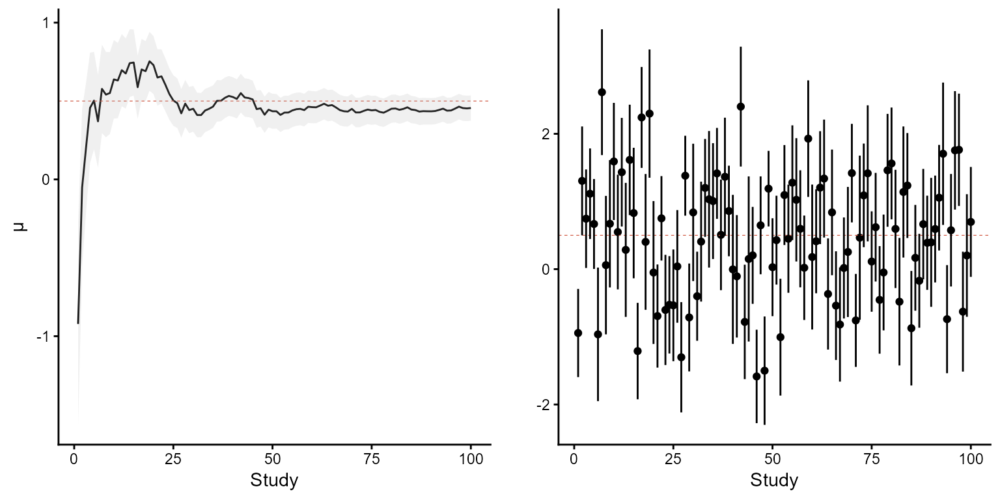

# Heterodox Bayes and Other Things (scrap book)

## Heterodox Bayes

In most cases, books on Bayesian ‘things’ focus directly on the
application of linear and generalized linear models of MCMC using JAGS,
Stan or Brms (see Gelman 2013, Kruschke, 2014, McElreath, 2015). The
previous books are - of course - recommended literature for any
statistician, methodologist or R user. However, these books are focused
directly on application of the preferred methods. They are called full
Bayesian methods considering it uses a full likelihood and prior on the
model parameters. These full Bayesian methods integrate full;
uncertainty’ about all parameters in the model ‘uncertainty’.

This section will focus largely on the theoretical parts Heterodox
Bayesian methods. These methods do not follow direct orthodox Bayes
interpretation. Often they miss an exact likelihood and thus in the
orthodox Bayesian sense do not directly attach ‘uncertainty’ to the
estimation of a probability measure of the data given some model
parameter. This in itself brings some challenges with the interpretation
of the outcomes as the probability is not a pure reflection of the data
given a model parameter.

A simple generalization of Bayes theorem as
$`Posterior \ probability \propto Likelihood \cdot Prior`$ which can be
more formally expressed as
$`P(\theta | x, I) \propto P(x|\theta) \cdot P(\theta | I)`$. Here
$`\theta`$ is the model parameter $`x`$ the data and $`I`$ denotes
information. Since I have been writing parts together and dumping
information in here the consistency of notations was not my concern at
all.

As discussed before the heterodoxy of many methods (not all) methods
describe here do $`Information? \ \propto Funky\ thing \cdot Prior`$.
Because the likelihood is not an exact, the posterior is that neither. A
standard notation could be like
$`P(\theta|x, I, \omega) \propto \omega(x, \theta) \cdot P(\theta|I)`$.
Here $`\omega`$ would indicate a loss, pseudo-likelihood, weight or
other data generating model or something else. I denoted it in the
posterior so that it is explicitly clear it is not a formal (orthodox)
Bayes. A full expression would then be of the form

``` math

P(\theta|x, I, \omega) = \frac{\omega(x, \theta)\cdot P(\theta | I)}{\int  \omega(x, \theta)\cdot P(\theta | I) \cdot d(\theta)}
```

In this equation the $`x`$ representing the data and $`\theta`$ a
quantity of interest and $`I`$ prior information. The $`L`$ denotes some
data dependent function. In this view, the posterior need not be
interpreted as a conditional probability under a joint model for data
and parameters. It may instead be understood as a normalized
re-weighting of prior information by a data-dependent functions of the
model parameter.

In general this also brings some benefits with it. Assume we take the
following proposition of Box (1976) ‘all models ar wrong’ (I disagree
all models are correct because
$`dependent \:variable = slope \cdot independent \:variable =\ 5= 2 * 2 + 1)`$
The ‘correctness’ within a formal language is something different then
the represented phenomenon. If Box meant the later I can agree).

``` math

p_1 = \{ \text{Models do not ontologically exist they are concepts} \}
```
and so also probability is a model then (de Finetti, 1974)

``` math

p_2 = \{ \text{Probability does not ontologically exist} \}
```
If we take these propositions serious then a claim to an ontological
property based on a model would not exists. Causality, effects,
associations or model parameters. Furthermore, claims about what exists
based on a model would also be invalid on the model alone. What on the
model alone can be claimed is the coherence within a language
(Wittgenstein, 1953). Therefore, an ontological statement based on a
parameter is form of model reification (Frege, 1948; Ryle 1949;
Wittgenstein, 1953).

The question arising from these statements what this belief/idea/thought
about the model parameter? Skepticism blocks us to commit ontological.
The resulting position is therefore not that effects, causes,
associations, or probabilities cannot exist. It is that their
ontological existence is not established merely by their appearance in
an inferential model. The pragmatic question becomes what differences
follow from adopting one representation rather than another, and how
those consequences withstand confrontation with experience. Then we can
simply say lets see what works (James, 1907).

### Classical statistics and estimation

All statistics focuses on estimating the parameter of interest
$`\theta`$ which in most (G)LMs is denoted as the parameter $`\mu`$ or
$`\beta`$. For consistency I will often use the parameter of interest by
$`\theta`$. The later is presented as a more general expression for
e.g., mean, median, mode etc. The next section will focus on $`mu`$ as
is common in estimation.

The population parameter $`\mu`$ is fixed but unknown. To investigate
the plausible values for $`\mu`$, we collect measurements or samples.
These observed data points, denoted as $`x = {x_1, \dots, x_n}`$, are
realizations of an underlying random variable $`X = {X_1, \dots, X_n}`$,
where each $`X_i \in \mathbb{R}`$. We assume that these observations are
independently and identically distributed (i.i.d.) from a common
distribution.

``` math

X\stackrel{\text{iid}}{\sim} N(\mu, \sigma^2)
```

Since we do not have $`X`$ but only a set of realizations we need an
estimator, which is the sample mean $`\bar{x}(x)`$. Hence, the sample
mean would be

``` math

\bar{x}=\frac{\sum_{i=1}^n(x_i)}{n}
```

If x is indeed i.i.d. then $`\hat{x}`$ would serve as an unbiased
estimator for $`\mu`$. Therefore, the sample mean has certain
properties.

``` math

\mathbb{E}[\bar{x}]=\mu \ and \ SD(\bar{x})=\frac{\sigma}{\sqrt{n}}
```

Then according to the weak law of large numbers suggest that the
probability of deviation from the population parameter decreases when
sample size $`n`$ increases till it eventually converges.

``` math

\lim_{n\to\infty} P\left(|\bar{X}_n-\mu|\geq \epsilon\right)=0
```
This means that according to the central limit theorem
``` math

Z_n=\frac{(\bar{X}_n-\mu)}{\sigma/\sqrt(n)}
```
converges to the normal. The probability of observing $`Z`$ under a
long-run of repetitions

``` math

P(-1.96\lesssim Z \lesssim 1.96)=0.95
```
.

Similar, the probability of the intervals of $`\bar{x}`$ to cover
$`\mu`$ in a long-run of repeated experiments at 95% is

``` math

1  - c = P(\bar{X}_n > \mu - 1.96 \cdot \frac{\sigma}{\sqrt{n}}) ~\text{and}~  P(\bar{X}_n < \mu - 1.96 \cdot \frac{\sigma}{\sqrt{n}})
```
.

A visual explanation of this concept is provided in the following Shiny
app: <https://snwikaij.shinyapps.io/shiny/>.

Furthermore, it is clear that statistics (alone) has nothing to do with
causality and the focus is error-control. Causality starts by satisfying
theoretical conditions needed the arrive at believes in these concepts.
Hence, error-control and causality start a-priori (Fisher 1949, Pearl
2009, Mayo 2018). Such a focus and framework is extremely useful if
objectivity over repetitions are the goal and favorable. While classical
statistics focuses on fixed but unknown parameters, error-control and
objectivity of information, Bayesian methods extend this perspective by
introducing prior information and viewing parameters as random
variables. This shift opens the door to more flexible and informative
inference, as explained in the next section.

### Bayes theorem and probablistic estimation

#### Bayes theorem

Informally Bayes Theorem would be notated
$`\text{Posterior}\, \text{probability} = \frac{\text{Likelihood} \cdot \text{Prior}}{\text{Evidence}}`$.
More formally Bayes theorem is often notated with A and B where P
indicates probability and ‘\|’ given or conditional on.
$`P(A|B) = \frac{P(B|A) \cdot P(A)}{P(B)}`$. Other expression such as
$`P(\theta|Data, Information) = \frac{P(Data|\theta) \cdot P(\theta|Information)}{P(Data)}`$
are to highlight that the posterior describes the information of that
conditional on the prior information that is given. Many more notations
are common where $`\theta`$ is used to express a quantity of interested,
mostly the expected values of a model parameter. This often in
combination with $`x`$ that represent the data. Below I will use A and
B.

The derivation of Bayes theorem relies on the axioms probability theory.

**Premise 1)**

``` math

P(A | B) = \frac{P(A \cap B)}{P(B)}
```
similarly

``` math

P(B |A) = \frac{P(B \cap A)}{P(B)}
```
**Premise 2)**

Also, the joint probability, expressed as a set-theoretic relationship
on $`z`$, indicates that element of both sets are the same.

``` math

z = \{x : x \in A \cap B : x \in B \cap A\}
```
thus

``` math

P(A \cap B) = P(B \cap A)
```
**Premise 3)**

In accordance with the previous

``` math

P(A| B) \cdot P(B) = P(A \cap B)
```
and

``` math

P(B | A) \cdot P(A) = P(B \cap A)
```
**Conclusion)**

Therefore

``` math

P(A | B) \cdot P(A) = P(B | A) \cdot P(B)
```

``` math

P(A|B) = \frac{P(B|A) \cdot P(A)}{P(B)}
```

#### Sequential updating

As formally introduced the frequentist optimizes over a long-run of
repeated experiments so that the coverage, denoted as $`c`$ is $`1-c`$.
More formally $`c`$ would be expressed as $`\alpha`$. The Bayesian does
not focus on the consistency between studies or error, between studies.
The Bayesian focuses on the coherence from prior to posterior. The
Bayesian focuses more on precision and information containment (?).
Bayesian sequential updating then seem to naturally follow from that.

Bayesian sequential updating refers to the practice of re-using the
derived posterior of a previous model as the prior for the new model.
For this the assumption of conditional independence between the the
datasets is assumed. The parameter of interest is $`\theta`$ based on a
dataset $`x_1`$ and we derive the posterior.

``` math

P(\theta \mid I, x_1) = \frac{P(x_1 \mid \theta) \cdot P(\theta)}{P(x_1 \mid I)}
```
The next would be

``` math

P(\theta \mid I, x_1, x_2) = \frac{P(x_2 \mid \theta) \cdot P(\theta \mid I, x_1)}{P(x_2)}
```
till

``` math

P(\theta \mid I, x_n) = \frac{P(x_n \mid \theta) \cdot P(\theta \mid I, x_1,\cdots,x_{n-1})}{P(x_n)}
```

For example, we would like to know what $`\mu`$ from a population of
interest. Our example population has $`\mu=0.5`$, $`\sigma=5`$ and each
study would have an error of $`\alpha = 40\%`$ when when we assume
$`\alpha=5\%`$ (meaning that our heterogeneity is larger than expected).
Our first prior starts with $`N(0, 5)`$ after which the posterior of
previous is sequentially re-used visually represented in Fig. 2a below.
Where more studies increase the precision of the estimated posterior.

If the focus lies on objectivity and the error-control over the
different studies and assume iid then the curve between studies would
follow that of Fig. 2b below.



*Figure 1: Sequential updating with credibility intervals on the left
panel and a long-run of means with confidence intervals on the right The
left panel.*

#### Bayes theorem and conjugate priors

The previous example works for simpler approximations yet if we want to
derive an interval for a particular parameter $`\theta`$ then we can
approach this analytically using conjugate priors. Where a prior is
conjugate to a likelihood if the resulting posterior is in the same
family as the prior.

As introduced, in statistics and estimation is about finding out the
value for $`\theta`$ which is assumed be $`\mu`$. Where in the
frequentist framework this is considered fixed and unknown, this is in
the Bayesian framework considered to be random ‘and approximately’
known. Of course also in the Bayesian framework samples $`x`$ are taken.
Assume that we already know something about $`\mu`$ then it is possible
to restrict to exclude unreasonable values or for the information we
have on $`\mu`$ to more acceptable values.

``` math

P(\theta|x,I) = \frac{P(x|\theta) \cdot P(\theta|I)}{P(x)}
```

For a simple mean and variance an analytical approach can be used to
derive the posterior given the likelihood and prior via the following
equations.

``` math

\begin{aligned}
\mu_{posterior}=\frac{\frac{\mu_{prior}}{\sigma_{prior}^2}+ \frac{\hat{x}_{data}}{\sigma_{data}^2}}{\frac{1}{\sigma_{prior}^2}+\frac{1}{\sigma_{data}^2}}\\\sigma_{posterior}=\sqrt{\frac{1}{\frac{1}{\sigma_{prior}^2}+\frac{1}{\sigma_{data}^2}}}
\end{aligned}
```

**Derivation:**

**Premise 1)**

Bayes rule can be simplified to

``` math

\begin{aligned}
P(\mu|x) \propto P(x|\mu) \cdot P(\mu)\\
N(\mu_{posterior}, \sigma_{posterior}^2) \propto N(\mu_{sample}, \sigma_{sample}^2)\cdot N(\mu_{prior}, \sigma_{prior}^2)
\end{aligned}
```

**Premise 2)**

The PDF for the normal distribution is

``` math

f(x)=\frac{1}{2\cdot \sqrt{\sigma \pi}}\cdot exp(-\frac{1}{2}(\frac{x-\mu}{\sigma})^2)
```

**Premise 3)**

``` math

\begin{aligned}
Prior: P(\mu_{prior})=\frac{1}{2\cdot \sqrt{\sigma_{prior} \pi}}\cdot exp(-\frac{1}{2}(\frac{\theta-\mu_{prior}}{\sigma_{prior}})^2)
\\
Likelihood: P(x|\mu_{sample})=\frac{1}{2\cdot \sqrt{\sigma_{sample} \pi}}\cdot exp(-\frac{1}{2}(\frac{\mu_{sample}-\theta}{\sigma_{sample}})^2)
\end{aligned}
```

**Premise 4)**

Both $`\frac{1}{2\cdot \sqrt{\sigma_{prior} \pi}}`$ and
$`\frac{1}{2\cdot \sqrt{\sigma_{sample} \pi}}`$ are scalars and can be
left out of the equation.

**Premise 5)**

Since both exponent have the same base we can add the exponent
``` math
(a^2+b^2=a^{2+2})
```
resulting in

``` math

exp(-\frac{1}{2}\cdot[(\frac{\theta-\mu_{prior}}{\sigma_{prior}})^2+(\frac{\mu_{sample}-\theta}{\sigma_{sample}})^2]
```

After which brackets can be moved

``` math

exp(-\frac{1}{2}\cdot[\frac{(\theta-\mu_{prior})^2}{\sigma_{prior}^2}+\frac{(\mu_{sample}-\theta)^2}{\sigma_{sample}^2}])
```

**Premise 6)**

Expanding the brackets terms

``` math

(a^2+b^2)=(a-b)\cdot(a-b)=a^2-ab-ab+b^2=a^2-2ab+b^2
```
This means

``` math

(\theta-\mu_{prior})^2=\theta^2-2\theta\mu_{prior}+\mu_{prior}^2
```

and

``` math

(\mu_{sample}-\theta)^2=\mu_{sample}^2-2\mu_{sample}\theta+\mu_{sample}^2
```
which can be replaced in premise 5

``` math

exp(-\frac{1}{2}\cdot[\frac{\theta^2-2\theta\mu_{prior}+\mu_{prior}^2}{\sigma_{prior}^2}+\frac{\mu_{sample}^2-2\mu_{sample}\theta+\mu_{sample}^2}{\sigma_{sample}^2}])
```

**Premise 7)**

Separating each term by dividing by $`\sigma_{prior}^2`$ and
$`\sigma_{sample}^2`$

``` math

exp(-\frac{1}{2}\cdot\frac{\theta^2}{\sigma_{prior}^2}+\frac{-2\theta\mu_{prior}}{\sigma_{prior}^2}+\frac{\mu_{prior}^2}{\sigma_{prior}^2}+
\frac{\mu_{sample}^2}{\sigma_{sample}^2}+\frac{-2\mu_{sample}\theta}{\sigma_{sample}^2}+\frac{\mu_{sample}^2}{\sigma_{sample}^2})
```

**Premise 8)**

Group each term by the nominator

``` math

\begin{aligned}
\frac{\theta^2}{\sigma_{prior}^2}+\frac{-2\theta\mu_{prior}}{\sigma_{prior}^2}+\frac{\mu_{prior}^2}{\sigma_{prior}^2}+
\frac{\mu_{sample}^2}{\sigma_{sample}^2}+\frac{-2\mu_{sample}\theta}{\sigma_{sample}^2}+\frac{\mu_{sample}^2}{\sigma_{sample}^2}=
\\
\theta^2(\frac{1}{\sigma_{prior}^2}+\frac{1}{\sigma_{sample}^2})+
-2\theta(\frac{\mu_{prior}}{\sigma_{prior}^2}+\frac{\mu_{sample}}{\sigma_{sample}^2})
+(\frac{\mu_{prior}^2}{\sigma_{prior}^2}+\frac{\mu_{sample}^2}{\sigma_{sample}^2})
\end{aligned}
```
Since the last group is not dependent on $`\theta`$ it is not in our
focus

``` math

\begin{aligned}
exp(-\frac{1}{2}\cdot[\frac{\theta^2}{\sigma_{prior}^2}+\frac{-2\theta\mu_{prior}}{\sigma_{prior}^2}+\frac{\mu_{prior}^2}{\sigma_{prior}^2}+
\frac{\mu_{sample}^2}{\sigma_{sample}^2}+\frac{-2\mu_{sample}\theta}{\sigma_{sample}^2}+\frac{\mu_{sample}^2}{\sigma_{sample}^2}=
\\
exp(-\frac{1}{2}\cdot\theta^2(\frac{1}{\sigma_{prior}^2}+\frac{1}{\sigma_{sample}^2})+
-2\theta(\frac{\mu_{prior}}{\sigma_{prior}^2}+\frac{\mu_{sample}}{\sigma_{sample}^2})
+not\ dependent\ on\ \theta])
\end{aligned}
```

**Premise 9)**

The goal is to derive $`P(\mu|x)`$ from
$`P(\mu|x) \propto P(x|\mu) \cdot P(\mu)`$ An the general exponential
form of the normal distribution is given in Premise 2 and the premises
6, 7 and 9 lead to

``` math

\frac{1}{2}\cdot \theta^2 (\frac{1}{\sigma^2})+\theta(\frac{\mu}{\sigma^2})+C=
\frac{1}{2}\cdot\theta^2A+\theta B+C
```

the general exponential form for the normal distribution is always
$`\frac{1}{2}\cdot\theta^2A+\theta B+C`$ meaning that
$`A=\frac{1}{\sigma^2}`$ and $`B=\frac{\mu}{\sigma^2}`$ and to obtain
the standard deviation $`A`$ needs to be re-arranged to
$`\sigma = \sqrt{\frac{1}{A}}`$ and to obtain the mean
$`\mu=\frac{B}{A}=\frac{\frac{\mu}{\sigma^2}}{\frac{1}{\sigma^2}}`$

**Conclusion)**

In Premise 8

``` math

\begin{aligned}
exp(-\frac{1}{2}\cdot\theta^2(\frac{1}{\sigma_{prior}^2}+\frac{1}{\sigma_{sample}^2})+
-2\theta(\frac{\mu_{prior}}{\sigma_{prior}^2}+\frac{\mu_{sample}}{\sigma_{sample}^2})+C)
\end{aligned}
```

In Premise 9

``` math

\begin{aligned}
\sigma = \sqrt{\frac{1}{A}}, A=\frac{1}{\sigma^2}\\
\mu=\frac{B}{A}=\frac{\frac{\mu}{\sigma^2}}{\frac{1}{\sigma^2}}
\end{aligned}
```

Which implies that

``` math

\begin{aligned}
\sigma_{posterior}=\sqrt{\frac{1}{\frac{1}{\sigma_{prior}^2}+\frac{1}{\sigma_{sample}^2}}}\\
\mu_{posterior}=\frac{\frac{\mu_{prior}}{\sigma_{prior}^2} + \frac{\mu_{sample}}{\sigma_{sample}^2}}{\frac{1}{\sigma_{prior}^2} + \frac{1}{\sigma_{sample}^2}}
\end{aligned}
```

Another way to obtain the posterior including the sample size is via:

``` math

\mu_{posterior}=\frac{\frac{\mu_{prior}}{\sigma_{prior}^2}+\mu_{sample}\cdot\frac{n}{\sigma_{sample}^2}}
{\frac{1}{\sigma_{prior}^2}+\frac{n}{\sigma_{sample}^2}}
```

**Derivation:**

**Premise 1)**

``` math

\begin{aligned}
Prior: P(\mu_{prior})=\frac{1}{2\cdot \sqrt{\sigma_{prior} \pi}}\cdot exp(-\frac{1}{2}(\frac{\theta-\mu_{prior}}{\sigma_{prior}})^2)
\\
Likelihood: P(x|\mu_{sample})=\prod_{i=1}^n \frac{1}{2\cdot \sqrt{\sigma_{sample} \pi}}\cdot exp(-\frac{1}{2}(\frac{x_i-\theta}{\sigma_{sample}})^2)
\end{aligned}
```

**Premise 2)**

Both $`\frac{1}{2\cdot \sqrt{\sigma_{prior} \pi}}`$ and
$`\frac{1}{2\cdot \sqrt{\sigma_{sample} \pi}}`$ are scalars and can be
left out of the equation.

**Premise 3)**

The likelihood is the product of $`n`$\>1 random variables
$`exp(a)\cdot exp(b) = exp(a+b)`$ thus
$`exp(a_i)\cdot, ...,\cdot exp(a_n)=exp(\sum_{i=1}^n(a_i))`$.

``` math

exp(\sum_{i=1}^n-\frac{1}{2}\cdot(\frac{x_i-\theta}{\sigma_{sample}})^2)=exp(-\frac{1}{2}\cdot\sum_{i=1}^n(\frac{x_i-\theta}{\sigma_{sample}})^2)
```
**Premise 4)**

As in premise 6 of the previous derivation we expand all terms and
ignore terms independent of $`\theta`$.

``` math

\sum_{i=1}^n(x_i-\theta)=\sum_{i=1}^nx_i^2-2x_i\cdot \theta +\theta^2
=\sum_{i=1}^nx_i-\sum_{i=1}^n2x_i\cdot\theta+\sum_{i=1}^n\theta^2=
\sum_{i=1}^nx_i-2\theta\sum_{i=1}^nx_i+\sum_{i=1}^n\theta^2=
-2\theta\sum_{i=1}^nx_i+n\theta^2
```

**Premise 5)**

Substitute the expression back into the equation.

``` math

exp(\frac{1}{2}\cdot[\frac{-2\theta\sum_{i=1}^nx_i+n\theta^2}{\sigma^2_{sample}}])
```

**Premise 6)**

The posterior can then be rewritten as
$`P(\mu|x) \propto P(x|\mu) \cdot P(\mu)`$

``` math

\begin{aligned}
exp(\frac{1}{2}\cdot[\frac{-2\theta\sum_{i=1}^nx_i+n\theta^2}{\sigma^2_{sample}}])
*exp(-\frac{1}{2}\cdot(\frac{\theta-\mu_{prior}}{\sigma^2_{prior}})^2)=\\
exp(\frac{1}{2}\cdot[\frac{-2\theta\sum_{i=1}^nx_i+n\theta^2}{\sigma^2_{sample}}+\frac{\theta-\mu_{prior}}{\sigma^2_{prior}})^2])
\end{aligned}
```

**Premise 7)**

Expanding the term of the nominator in the prior and substitute it back
in the previous equation.

``` math

\begin{aligned}
(\theta-\mu_{prior})^2=\theta^2-2\theta\mu_{prior}+\mu_{prior}^2
\\
\frac{\theta^2}{\sigma_{prior}^2}+\frac{-2\theta\mu_{prior}}{\sigma_{prior}^2}+\frac{\mu_{prior}^2}{\sigma_{prior}^2}
\\
exp(-\frac{1}{2}\cdot[\frac{\theta^2}{\sigma_{prior}^2}+\frac{-2\theta\mu_{prior}}{\sigma_{prior}^2}+\frac{\mu_{prior}^2}{\sigma_{prior}^2}+
\frac{-2\theta\sum_{i=1}^nx_i+n\theta^2}{\sigma^2_{sample}}])
\end{aligned}
```

**Premise 8)**

Expand the last term and divide by $`\sigma^2_{sample}`$

``` math

exp(-\frac{1}{2}\cdot[\frac{\theta^2}{\sigma_{prior}^2}+\frac{-2\theta\mu_{prior}}{\sigma_{prior}^2}+\frac{\mu_{prior}^2}{\sigma_{prior}^2}-
\frac{2\theta\sum_{i=1}^nx_i}{\sigma^2_{sample}}+\frac{n\theta^2}{\sigma^2_{sample}}])
```

**Premise 9)**

Group each term by its nominator

``` math

exp(-\frac{1}{2}\cdot\theta^2(\frac{1}{\sigma_{prior}^2}+\frac{n}{\sigma_{sample}^2})+
-2\theta(\frac{\mu_{prior}}{\sigma_{prior}^2}+\frac{\sum_{i=1}^nx_i}{\sigma_{sample}^2})
+not\ dependent\ on\ \theta])
```

Since: $`\sum_{i=1}^nx_i=\mu_{sample}\cdot n`$

``` math

exp(-\frac{1}{2}\cdot\theta^2(\frac{1}{\sigma_{prior}^2}+\frac{n}{\sigma_{sample}^2})+
-2\theta(\frac{\mu_{prior}}{\sigma_{prior}^2}+\frac{\mu_{sample}\cdot n}{\sigma_{sample}^2})
+not\ dependent\ on\ \theta])
```

**Conclusion)**

From the steps 8 and 9 in the previous derivation we arive at

``` math

\begin{aligned}
\sigma_{posterior}=\sqrt{\frac{1}{\frac{1}{\sigma_{prior}^2}+\frac{n}{\sigma_{sample}^2}}}\\
\mu_{posterior}=\frac{\frac{\mu_{prior}}{\sigma_{prior}^2} + \frac{\mu_{sample}\cdot n}{\sigma_{sample}^2}}{\frac{1}{\sigma_{prior}^2} + \frac{n}{\sigma_{sample}^2}}
\end{aligned}
```

As might be clear this is less computational heavy than MCMC methods.
For more then two parameter such an analytically approach becomes more
cumbersome. And, if conjugacy is not satisfied no closed form solution
is available. In this regards, Laplacian approximation is also
computational easy. Yet, the equation clearly formulate the idea what
happens in Bayes theorem.

#### Generalized Bayes Updating

Standard Bayesian models update the likelihood and prior to the
posterior via

``` math

P(\theta|x) = \frac{ P(x|\theta) \cdot P(\theta)}{P(x)}
```

taking the log of the terms results in

``` math

log(P(\theta|x)) = log(P(x|\theta)) + log(P(\theta)) - log(P(x))
```

Here the likelihood is written as $`-log(P(x|\theta))`$, the negative
log-likelihood. So this is similar to

``` math

\begin{aligned}
-log(P(x|\theta))=L(x; \theta)\\
log(P(x|\theta))=-L(x; \theta)
\end{aligned}
```

where $`L`$ is a loss function of the data $`x`$ connected to the model
parameter $`\theta`$. Fully, this is corresponding to

``` math

log(P(\theta|x)) = -L(x; \theta) + log(P(\theta)) - log(p(x))
```

The exponent of this becomes

``` math

exp(log(P(\theta|x))) = exp(-L(x; \theta)) \cdot exp(log(P(\theta))) \cdot exp(-log(P(x)))
```

This results in

``` math

P(\theta|x) = exp(-L(x; \theta)) \cdot P(\theta) \cdot \frac{1}{P(x)}
```

which is equally to

``` math

P(\theta|x) = \frac{exp(-L(x; \theta)) \cdot P(\theta)}{P(x)}
```

which can be re-written as

``` math

P(\theta|x) = exp(-L(x; \theta)) \cdot P(\theta)
```

#### Approximate Bayesian Computation with rejection sampling

Approximate Bayesian Computation with rejection sampling (ABC-rejection)
is a computationally expensive method for approximating the posterior
distribution. However, when the number of parameters is relatively
small, the posterior can still be approximated quite well. ABC-rejection
is especially useful when the likelihood function cannot be computed or
approximated accurately.

In a simplified case, assuming both the prior and the data-generating
model are normally distributed, the ABC-rejection algorithm begins by
simulating a parameter from the prior distribution.

``` math

\begin{aligned}
\mu_{i}^*\sim N(\mu_{prior},\sigma_{prior}^2) \\
\sigma_{i}^{2*}\sim Exp(rate)
\end{aligned}
```

The asterisk ($`^*`$) denotes that these parameters are temporary, and
this will become important later.Next, a data-generating model is used
to simulate data based on these temporary parameters. We assume the
observed data is approximately normally distributed, though any model
could be used. For each simulation, we generate $`n_{data}`$ values.

``` math

x_{i}\sim N(\mu^*, \sigma^{2*})
```

Depending on the parameter of interest (e.g., $`\mu`$, $`\sigma`$, mode,
or median), a summary statistic is computed from the simulated data. In
this example, we focus on estimating $`\mu`$.

``` math

\hat{x}_{sim, i}=\frac{\sum_{i=1}^n(x_i, ..., x_n)}{n_{data}}
```

Each simulated mean $`\hat{x}_{sim, i}`$ (typically out of 100,000
simulations) is compared to the observed mean $`\hat{x}_{data}`$ using
the Euclidean distance.

``` math

E_{i}=\sqrt{(\hat{x}_{sim, i} - \hat{x}_{data})^2}
```

A tolerance threshold is then selected to determine which simulated
values are accepted. Simulations with $`E_i > tolerance`$ are rejected,
while those with $`E_i \leq tolerance`$ are retained. While a tolerance
of zero would yield the most accurate posterior, it would typically
result in rejecting all simulations. On the other hand, setting the
tolerance too high would allow in too many poor matches.

Each accepted simulation corresponds to an accepted pair of simulated
parameters $`\mu_{i}^*, \sigma_{i}^{2}*`$. Since all $`\mu_{i}^*`$ were
originally drawn from the prior, the subset of accepted values
approximates the posterior distribution of $`\mu`$.

### Introduction to Bayesian Model Averaging (BMA)

Instead of $`P`$ the function ‘$`f`$’ are used this to highlight that
the probability is a mapping function. A mapping function being a ‘rule’
that maps $`x`$ to $`y`$ and so $`y=f(x)`$.

``` math

f(\theta \mid x, I) = 
\frac{f(x \mid \theta) \cdot f(\theta \mid I)}
{\int f(x \mid \theta) \cdot f(\theta \mid I) \cdot d\theta}
```
The integral in the denominator is used to scale the posterior
probability to one. This expression is sometimes simplified to

``` math

f(\theta \mid x, I) = f(x \mid \theta) \propto f(\theta \mid I)
```

Where the $`\propto`$ symbol indicates ‘proportional to’. Therefore, the
posterior is nothing more than a function that describes the probability
$`y`$ as a function of $`\theta`$ conditional on $`x`$ and $`I`$
($`y=f(\theta \mid x, I)`$). This cannot be solely conditional on the
$`x`$ as the $`x`$ is not uncertain our information (‘belief’
thoughts/ideas) is uncertain about a none existing object $`\theta`$
(unless Platonism is true).

In the previous part a single prior model was used. Bayesian Model
Averaging (BMA) has the advantages that it allows multiple ($`k`$)
functions to be utilized as prior. I specifically choose the use of
$`f`$ so multiple priors as $`f_k`$ in the equation below can be seen
nothing more as multiple functions (or models). This in my opinion makes
it easier to see that there is only optimized between multiple
functions. It sound weird to say to optimize between probabilities.

Hence, multiple possible scenarios that could have been responsible for
$`\beta`$ can be introduced as below.

``` math

f(\theta \mid x, I) = \frac{f(x \mid \theta) \cdot f_k(\theta \mid I)}{\int \left( \sum_{k=1}^{k} f(x \mid \theta) \cdot f_k(\theta \mid I) \right)}
```

Now it should be clear that each $`\theta`$ contained within
$`g(E(y \mid x_{ij})) = \sum_{j=1}^{v} \beta_j \cdot x_{ij}`$ is being
restricted by the prior models. While in frequentism it is unrestricted
and ‘complete indifference’ towards the possibility of $`\theta`$. All
these methods can be used in a meta-analysis.

### Meta-analysis

A standard meta-analysis uses a measure of location (mean) and scale
(precision) to estimate a pooled value based on all parameters. For a
fixed meta-analysis the pooled parameter is derived via the following
equation.

``` math

\theta_{pooled} = \frac{\sum_{i=1}^{k}(\theta_i\cdot w_i)}{\sum_{k=1}^kw_i}
```
$`\theta_i`$ is the extracted effect-size for a study $`i`$. The $`w_i`$
is the weight per study $`i`$ for all $`k`$ studies, derived from the
precision $`1/se_i^2`$ via the equation below.

``` math

w_i = \frac{1}{se_i^2}
```

The standard error for the pooled effect-size can then be derived via
the formula given below.

``` math

se(\theta_{pooled})=\frac{1}{\sqrt\sum_{i=1}^{k}(w_i)}
```
For a random-effect meta-analysis the variance between studies is
separately modeled. In the metafor package REML or (Restricted Maximum
Likelihood) is used to estimate this between study variance. However it
is also possible using the DerSimonian and Laird method.

``` math

\begin{aligned}
\tau^2=max(0, \frac{Q-(k-1)}{\sum_{i=1}^{k}\frac{1}{w_i}-\frac{\sum_{i=1}^{k}1/w_i^2}{\sum_{i=1}^{k}1/w_i}})\
\\
w^*_i=\frac{1}{(\frac{1}{w_i}+\tau^2)}
\\
\theta_{pooled} = \frac{\sum_{i=1}^{k}(\theta_i\cdot w^*_i)}{\sum_{i=1}^{k}(w^*_i)}
\\
se(\theta_{pooled})=\frac{1}{\sqrt(\sum_{i=1}^{k}w^*_i)}
\end{aligned}
```

If we now go back to how we analytically derived the posterior we can
devise a function that can analytically perform a fixed effect
meta-analysis with ease. I have placed this in a function called
‘abmeta’. In in simple cases it approximates the results of metafor and
the meta function inf EcoPostView relatively well. Of course the
variance component slightly differs with that from metafor and the
‘meta’ function due to the different method of estimation.

### BMA and meta-analysis

In a meta-analysis we do not talk about $`\beta`$ but about a set of
estimates $`\theta=\{\theta_{i}, ..., \theta_{n}\}`$ meaning that
$`f(x_{meta-data}\mid\{\theta_{i}, ..., \theta_{n}\})`$. Hereby the
flexibility allows that these estimates are either likelihood estimates
($`\hat{\theta}`$) or posterior estimates ($`\beta`$). and we end up
with an expression that should capture the inference to an underlying
pooled model parameter.

``` math

f(\theta_{poolded} \mid x_{meta-data}, I) = \frac{f(x_{meta-data} \mid \{\theta_{i}, ..., \theta_{n}\}) \cdot f_k(\theta_{pooled} \mid I)}{\int \left( \sum_{k=1}^{m} f(x_{meta-data} \mid \{\theta_{i}, ..., \theta_{n}\}) \cdot f_k(\theta_{pooled} \mid I) \right)}
```
Assuming the pooled parameter $`\beta_pooled`$is derived the equation
layed out before the variance of the pooled parameter can be
analytically derived as given by Hoeting et al. (1999):

``` math

\begin{aligned}
SE(\theta_{pooled}) = \sqrt{\sum^m_{k=1}( w_{prior} \cdot (\theta_k^2+SE(\theta_k)^2))-\theta_{pooled}^2}\\
\end{aligned}
```

### A short reflection on uncertainty

I do not think statistics reflects uncertainty about events; rather, it
reflects the information in the data under a particular model in a
parameter ($`\theta, \beta, \mu`$, etc.). The later concept is often
ambiguous and confusing because, if one assumes the parameter does not
exist independently of the mind, then what exactly is uncertain - our
thoughts? The claim to ‘objective probability’ is already compromised by
the assumption that the parameter is objective. However, if the
parameter does not exist outside the mind, the meaning of ‘objective’ in
this context becomes questionable.

When people refer to objectivity, they often mean that the data itself
is the most ‘objective’ part of a data-generating-process. However, if
some conditions are not met, such as (1) the data is not a proper
representation of the data-generating-process of interest, (2) the model
is not pre-selected in advance, and (3) a sufficiently large sample size
is not chosen based on the model, then even the data cannot be
considered truly objective part of a data-generating-process. Moreover,
model selection procedures further contaminate the objectivity of the
data, meaning that the estimated model parameters no longer fully
reflect the objectivity of the data which is often implied in our
conclusions (Gelman and Loken, 2013; Tong, 2019).

In Bayesian updating, the prior reflects the extent to which we want to
sacrifice over the objectivity (Ignorance of any prior information) of
the likelihood by using information which cannot be formalized into the
likelihood. This is captured by the relationship
$`f(\theta \mid x, I) = f(x \mid \theta) \propto f(\theta \mid I)`$

The posterior, therefore, is merely the weighted combination of the
prior and likelihood. It represents the relationship (e.g., $`0.25`$ as
$`0.5 \cdot 0.5`$) between the prior and the likelihood. There is no
invalidity in a logical argument such as:(Premise 1.) All unicorns are
orange. (Premise 2.) I have a unicorn. (Conclusion) Therefore, my
unicorn is orange.

While this argument may be unsound — because unicorns do not exist — the
reasoning itself is not flawed. The issue lies with the premises, not
the structure of the argument. Hence, uncertainty does not exist in the
‘real’ world; it resides solely in our minds. We cannot be ‘wrong’ or
‘correct’ about $`f(\theta \mid x, I)`$ because it does not exist as a
tangible entity/object. Even if it did, its existence would have no
impact on reality because uncertainty is unrelated to the way reality
operates. In the real world, events either occur or they do not. If my
unicorn does not exist, I will never see it, and it was never orange in
the first place.

We should also avoid treating models as a definitive representation of
reality. Models are tools that convey information and serve as pragmatic
instruments. The the model itself is not the result, the strength of the
results relies on the argument, and how well the premises within the
argument are clarified and supported by the model.
