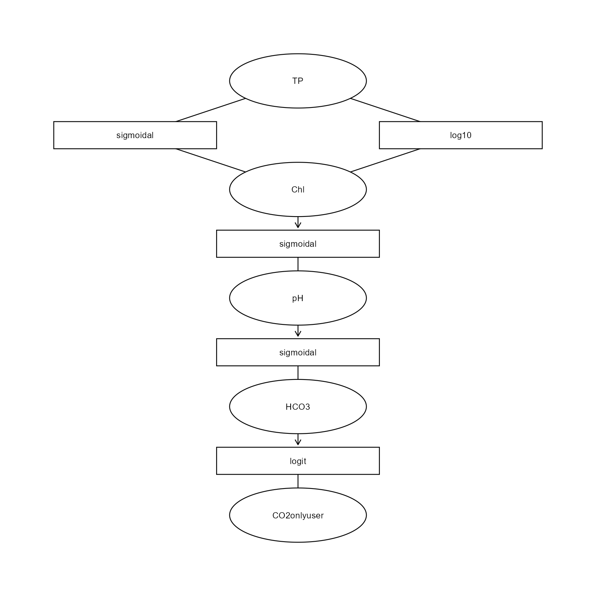
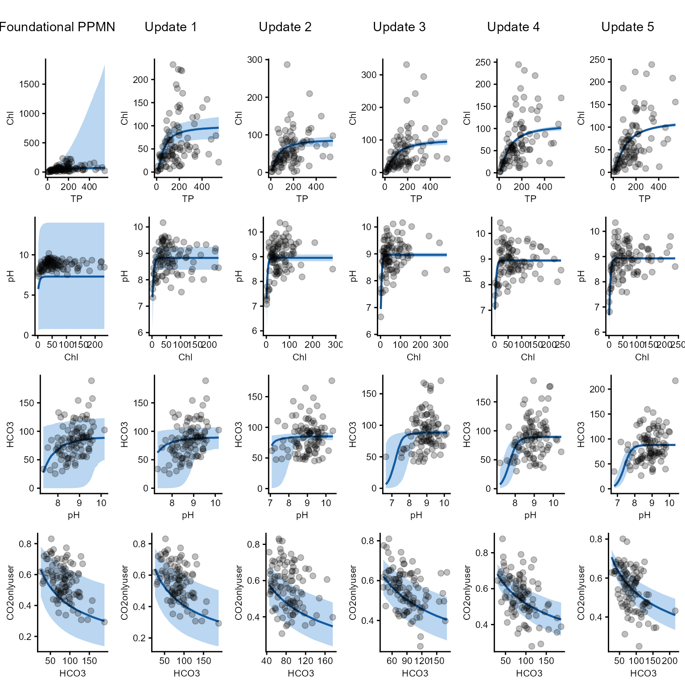
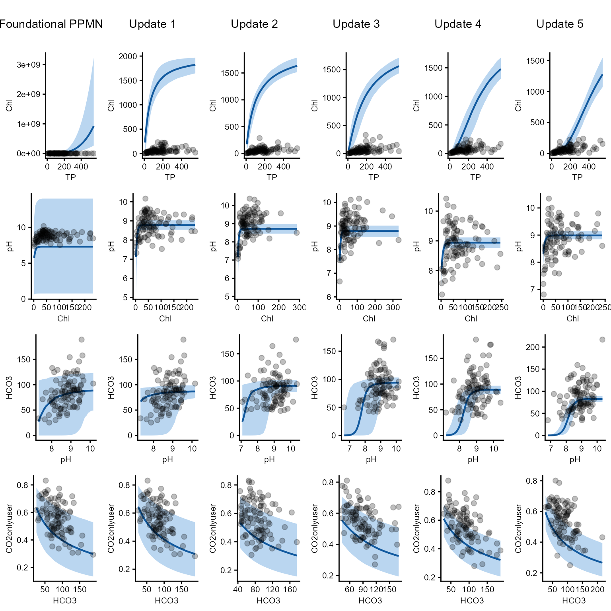
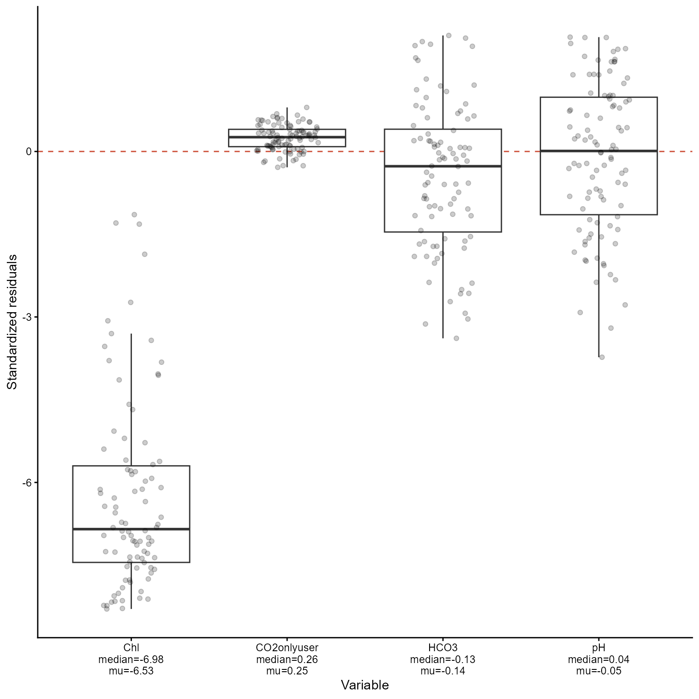
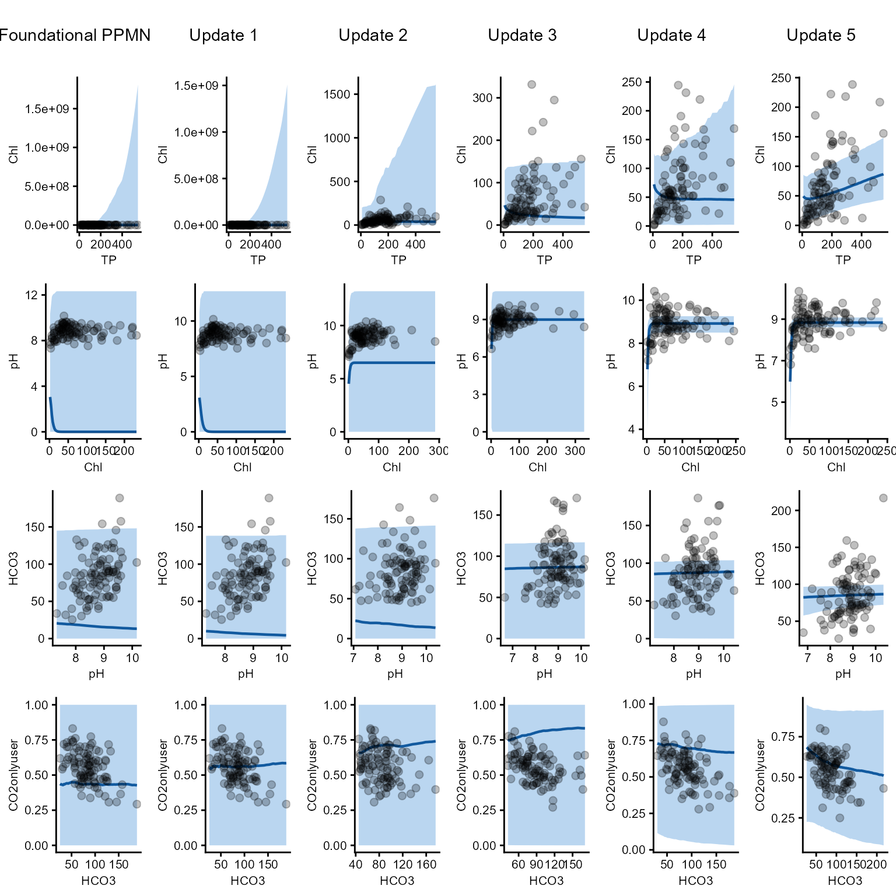
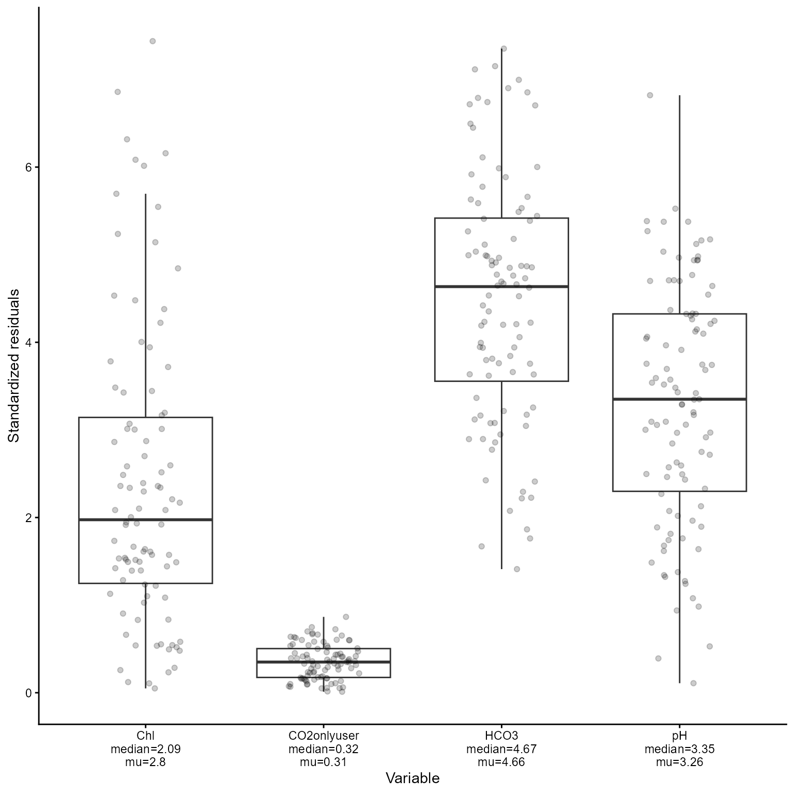

# Playing around with the PPMN

## Introduction

This section is intended to experiment with and explore the PPMN
method/framework. To understand how it behaves under different
conditions, one of the most informative approaches is to “crash-test”
it. Understanding the limits of the method is important for determining
what it can and cannot do, as well as for identifying possible new
diagnostics to assess when it fails.

I have only recently started exploring this aspect of the PPMN method,
as my initial focus was on developing and implementing the method
itself. Nevertheless, there are already some situations in which failure
is expected. For example, a highly unrealistic priors (e.g., the
foundational PPMN) can cause the method to break down.

### Simple sequential update

Below is an example of a setting in which the method does work.
Sequential updating is a particularly important use case I have in mind
for the PPMN framework. Suppose that we obtain batches of 100 samples
from an ecosystem (e.g, for example, from a lake catchment area) once
per year over a period of five years. Each batch is then fed
sequentially into the PPMN, allowing us to examine how the model updates
as new data become available. The figure following the code illustrates
this updating process.

``` r
library(HeMiE)
library(ggplot2)
library(cowplot)

#set number of sequential updates
number_sequential <- 5

#create a network
example_data <- data.frame(
  edge = c(
    rep("Chl~TP", 3),
    rep("Chl~TP", 2),
    rep("pH~Chl", 3),
    rep("HCO3~pH", 3),
    rep("CO2onlyuser~HCO3", 2)),

  `function` = c(
    rep("sigmoidal", 3),
    rep("log10", 2),
    rep("sigmoidal", 3),
    rep("sigmoidal", 3),
    rep("logit", 2)),

  transformation = c(
    rep("log", 3),
    rep("log10", 2),
    rep(NA, 3),
    rep(NA, 3),
    rep("log", 2)),

  parameter = c(
    "b0","b1","b2",
    "b0","b1",
    "b0","b1","b2",
    "b0","b1","b2",
    "b0","b1"),

  estimate = c(
    100,   4, 0.5,   # Chl ~ TP
    -1.1,   1,       # Chl ~ TP
    7.5,  -4,   4,   # pH ~ Chl
    90,  7.5, 0.2,   # HCO3 ~ pH
    2.8,-0.7),       # CO2onlyuser ~ HCO3

  error = c(
    20,   0.5, 0.25,
    0.3, 0.4,
    4,  2,      1,
    20,   1.5, 0.05,
    0.3,  0.1))

#create formula
formula <- list(c(fun="sigmoidal", edge="Chl~TP", trans="log"),

                c(fun="log10", edge="Chl~TP", trans="log10"),

                c(fun="sigmoidal", edge="pH~Chl"),

                c(fun="sigmoidal", edge="HCO3~pH"),

                c(fun="logit",     edge="CO2onlyuser~HCO3",  trans="log"))

#build ppmn
mod1    <- build_ppmn(formula, example_data)

#this is the ppmn structure
mod1$PlotDBN
```



``` r

#create a dgp ppmn
mod_dgp <- mod1

#select some 'true' and fixed params
true_par <- list(
  `ef1`           = c(b0=110, b1=4.5, b2=.7),
  `ef2`           = c(b0=-0.8, b1=.9),
  `ef3`           = c(b0=9,   b1=-7,  b2=6),
  `ef4`           = c(b0=100, b1=7,   b2=1),
  `ef5`           = c(b0=2.4, b1=-.5))

#store the params
for(e in names(mod_dgp$Parameters)){
  for(p in names(mod_dgp$Parameters[[e]])){
    mod_dgp$Parameters[[e]][[p]]["mu"] <- true_par[[e]][p]}}

#gamma simulator
rgamma_sim <- function(mu, sd){rgamma(length(mu), shape = mu^2/sd^2,rate  = mu/sd^2)}

#set TP concentration
set.seed(123)
TP_sim <- rgamma(100, 200^2/150^2, 200/150^2)

#create storage location
test_dfs <- list()

#create 5 realized data sets
for(d in seq_len(number_sequential)){
mu_Chl  <- .ppmn_predict_edge("sigmoidal", true_par$ef1, trans="log", TP_sim)
Chl_sim <- rgamma_sim(mu_Chl, mu_Chl/1.5)

mu_pH   <- .ppmn_predict_edge("sigmoidal", true_par$ef3, trans=NA, Chl_sim)
pH_sim  <- rgamma_sim(mu_pH, rep(.5, length(mu_pH)))

mu_HCO3 <- .ppmn_predict_edge("sigmoidal", true_par$ef4, trans=NA, pH_sim)
HCO3_sim<- rgamma_sim(mu_HCO3, mu_HCO3/3)

mu_CO2  <- plogis(true_par$ef5[1]+true_par$ef5[2]*log(HCO3_sim))

CO2onlyuser <- rbeta(length(mu_CO2), shape1 = mu_CO2*20,
                     shape2 = (1-mu_CO2)*20)

test_dfs[[d]] <- data.frame(
  TP = TP_sim,
  Chl = Chl_sim,
  pH = pH_sim,
  HCO3 = HCO3_sim,
  CO2onlyuser = CO2onlyuser)}

#sequentially update the ppmn on the different data sets
mod_list      <- vector("list", (number_sequential+1))
mod_list[[1]] <- mod1
for(u in 2:length(mod_list)){
m <- u-1
mod_list[[u]] <- update_ppmn(mod_list[[m]], test_dfs[[m]])}

#plot df correct lengths first one should be duplicated
plot_dfs <- c(test_dfs[1], test_dfs)

#plot all childs and variables
vars <- c("Chl", "pH", "HCO3", "CO2onlyuser")
var_list <- setNames(
  lapply(vars, function(v){Map(function(mod, dat)
    marginal_ppmn(mod, child = v, data = dat),
     mod_list, plot_dfs)}), vars)

#create labels for above the figures
labs <- c("Foundational PPMN", paste("Update", seq_len(number_sequential)))
labtext <- lapply(seq_len(number_sequential+1), function(l)
ggplot() +
annotate("text", label=labs[l], x=0, y=0)+
theme_void())

#create correct order for figs 
figs <- seq_len(number_sequential+1)
fig_list <- c(
  labtext[figs],
  lapply(figs, \(i) var_list$Chl[[i]][[3]]),
  lapply(figs, \(i) var_list$pH[[i]][[1]]),
  lapply(figs, \(i) var_list$HCO3[[i]][[1]]),
  lapply(figs, \(i) var_list$CO2onlyuser[[i]][[1]]))

#plot all the figures together
cowplot::plot_grid(
  plotlist = fig_list,
  ncol = (number_sequential+1),
  rel_heights = c(1, 3, 3, 3, 3, 3))
```



### Sequential updating and poorly specified priors at roots

If poorly specified priors are present at root nodes, biased predictions
can propagate downstream through the network. As a consequence, the
corresponding edge functions may also converge toward parameter regions
that are ecologically implausible or otherwise outside a reasonable
range. Such behaviour can, however, be diagnosed by visually inspecting
the marginal plots or by examining the residual distributions in the
boxplots.

At the same time, this provides a useful learning opportunity. If the
foundational PPMN is based on a large amount of synthesized literature,
but repeated updating with new data consistently drives the model away
from a decent fit, this indicates a substantive issue that requires
explanation. Either the new data are unrepresentative or problematic, or
the prior information synthesized from the literature does not
generalize to the system under study. In that way, disagreement between
the foundational PPMN and new observations can itself reveal an
important gap in our understanding.

``` r

#create a network
example_data <- data.frame(
  edge = c(
    rep("Chl~TP", 3),
    rep("Chl~TP", 2),
    rep("pH~Chl", 3),
    rep("HCO3~pH", 3),
    rep("CO2onlyuser~HCO3", 2)),

  `function` = c(
    rep("sigmoidal", 3),
    rep("log10", 2),
    rep("sigmoidal", 3),
    rep("sigmoidal", 3),
    rep("logit", 2)),

  transformation = c(
    rep("log", 3),
    rep("log10", 2),
    rep(NA, 3),
    rep(NA, 3),
    rep("log", 2)),

  parameter = c(
    "b0","b1","b2",
    "b0","b1",
    "b0","b1","b2",
    "b0","b1","b2",
    "b0","b1"),

  estimate = c(
    2000,   4,   1,  # Chl ~ TP #bad priors for asymptote and scale
    -0.3, 3.5,       # Chl ~ TP #bad priors for slope and intercept
    7.5,   -4,   4,  # pH ~ Chl
    90,   7.5, 0.2,  # HCO3 ~ pH
    2.8, -0.7),      # CO2onlyuser ~ HCO3

  error = c(
    20,   0.3,  0.2,
    0.2,  0.1,
    4,      2,    1,
    20,   1.5, 0.05,
    0.3,  0.1))

#build ppmn
mod1    <- build_ppmn(formula, example_data)

#sequentially update the ppmn on the different data sets
mod_list <- vector("list", (number_sequential+1))
mod_list[[1]] <- mod1
for(u in 2:length(mod_list)){
m <- u-1
mod_list[[u]] <- update_ppmn(mod_list[[m]], test_dfs[[m]])}

#plot df correct lengths first one should be duplicated
plot_dfs <- c(test_dfs[1], test_dfs)

#plot all childs and variables
vars <- c("Chl", "pH", "HCO3", "CO2onlyuser")
var_list <- setNames(
  lapply(vars, function(v){Map(function(mod, dat)
    marginal_ppmn(mod, child = v, data = dat),
     mod_list, plot_dfs)}), vars)

#create labels for above the figures
labs <- c("Foundational PPMN", paste("Update", seq_len(number_sequential)))
labtext <- lapply(seq_len(number_sequential+1), function(l)
ggplot() +
annotate("text", label=labs[l], x=0, y=0)+
theme_void())

#create correct order for figs 
figs <- seq_len(number_sequential+1)
fig_list <- c(
  labtext[figs],
  lapply(figs, \(i) var_list$Chl[[i]][[3]]),
  lapply(figs, \(i) var_list$pH[[i]][[1]]),
  lapply(figs, \(i) var_list$HCO3[[i]][[1]]),
  lapply(figs, \(i) var_list$CO2onlyuser[[i]][[1]]))

#plot all the figures together
cowplot::plot_grid(
  plotlist = fig_list,
  ncol = (number_sequential+1),
  rel_heights = c(1, 3, 3, 3, 3, 3))
```



``` r

#display the residuals of the first update
mod_list[[2]]$Residuals$resid_boxplot
```



### Sequential updating and non-informative prior

Using non-informative priors, the PPMN should in principle still update
appropriately, although convergence may be slower because the initial
parameter space is much broader. This also appears to be the case here.
The fit for the relationship HCO3~pH remains suboptimal, but clear
shifts toward a more reasonable fit are visible for the other edge
functions. A similar issue arises when fitting nonlinear models by
maximum likelihood, where successful numerical optimization can depend
strongly on the specification of suitable starting values, particularly
when the objective function contains multiple local optima or poorly
identified regions.

``` r

#create a network
example_data <- data.frame(
  edge = c(
    rep("Chl~TP", 3),
    rep("Chl~TP", 2),
    rep("pH~Chl", 3),
    rep("HCO3~pH", 3),
    rep("CO2onlyuser~HCO3", 2)),

  `function` = c(
    rep("sigmoidal", 3),
    rep("log10", 2),
    rep("sigmoidal", 3),
    rep("sigmoidal", 3),
    rep("logit", 2)),

  transformation = c(
    rep("log", 3),
    rep("log10", 2),
    rep(NA, 3),
    rep(NA, 3),
    rep("log", 2)),

  parameter = c(
    "b0","b1","b2",
    "b0","b1",
    "b0","b1","b2",
    "b0","b1","b2",
    "b0","b1"),

  estimate = c(
    200,  0,  0,  # Chl ~ TP 
    0,    0,      # Chl ~ TP 
    7.5,  0,  0,  # pH ~ Chl
    90,   0,  0,  # HCO3 ~ pH
    0,    0),     # CO2onlyuser ~ HCO3

error = c(
    100,  2,  2,
    2,    2,
    4,    2,  2,
    45,   2,  2,
    2,    2))

#build ppmn
mod1    <- build_ppmn(formula, example_data)

#sequentially update the ppmn on the different data sets
mod_list <- vector("list", (number_sequential+1))
mod_list[[1]] <- mod1
for(u in 2:length(mod_list)){
m <- u-1
mod_list[[u]] <- update_ppmn(mod_list[[m]], test_dfs[[m]])}

#plot df correct lengths first one should be duplicated
plot_dfs <- c(test_dfs[1], test_dfs)

#plot all childs and variables
vars <- c("Chl", "pH", "HCO3", "CO2onlyuser")
var_list <- setNames(
  lapply(vars, function(v){Map(function(mod, dat)
    marginal_ppmn(mod, child = v, data = dat),
     mod_list, plot_dfs)}), vars)

#create labels for above the figures
labs <- c("Foundational PPMN", paste("Update", seq_len(number_sequential)))
labtext <- lapply(seq_len(number_sequential+1), function(l)
ggplot() +
annotate("text", label=labs[l], x=0, y=0)+
theme_void())

#create correct order for figs 
figs <- seq_len(number_sequential+1)
fig_list <- c(
  labtext[figs],
  lapply(figs, \(i) var_list$Chl[[i]][[3]]),
  lapply(figs, \(i) var_list$pH[[i]][[1]]),
  lapply(figs, \(i) var_list$HCO3[[i]][[1]]),
  lapply(figs, \(i) var_list$CO2onlyuser[[i]][[1]]))

#plot all the figures together
cowplot::plot_grid(
  plotlist = fig_list,
  ncol = (number_sequential+1),
  rel_heights = c(1, 3, 3, 3, 3, 3))
```



``` r

#display the residuals of the first update
mod_list[[2]]$Residuals$resid_boxplot
```


