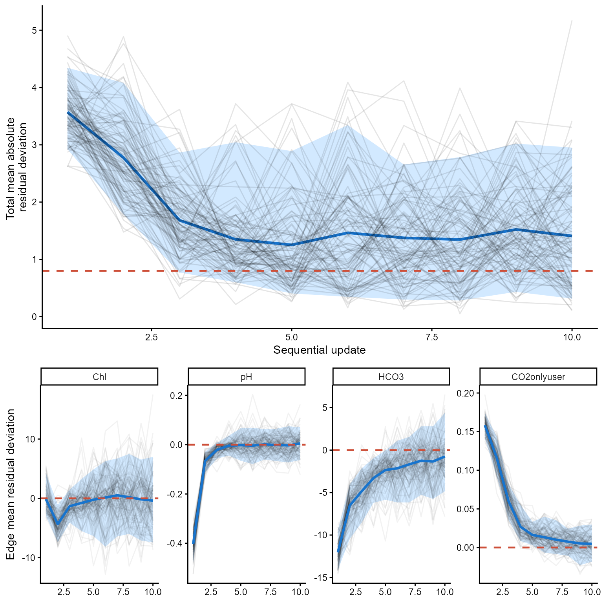
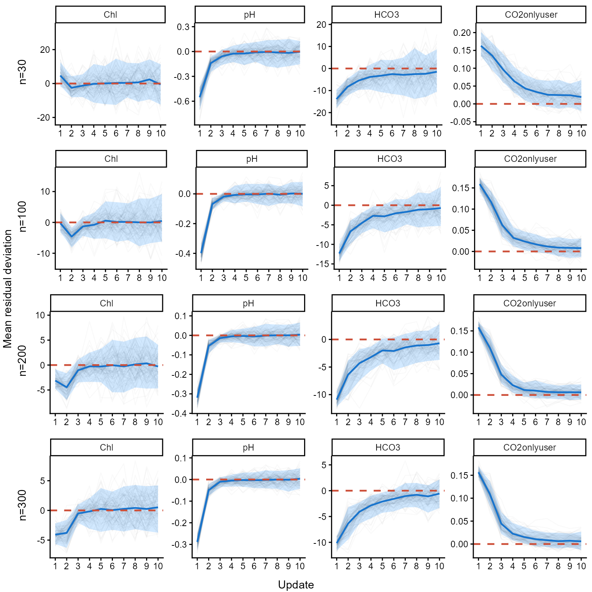
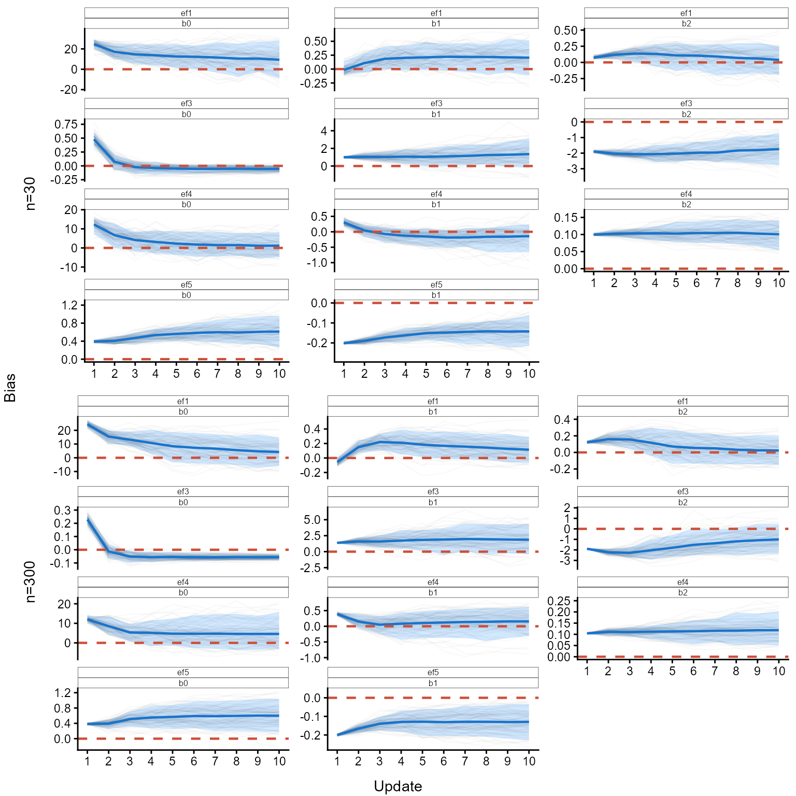

# Playing around with the PPMN

## Introduction

This section is intended to experiment with and explore the PPMN
method/framework. To understand how it behaves under different
conditions, one of the most informative approaches is to “crash-test”
it. Understanding the limits of the method is important for determining
what it can and cannot do, as well as for identifying possible new
diagnostics to assess when it fails.

I have only recently started exploring this aspect of the PPMN method,
as my initial focus was on developing and implementing the method
itself. Nevertheless, there are already some situations in which failure
is expected. For example, a highly unrealistic priors (e.g., the
foundational PPMN) can cause the method to break down.

### Simple sequential update

Below is an example of a setting in which the method does work.
Sequential updating is a particularly important use case I have in mind
for the PPMN framework. Suppose that we obtain batches of 100 samples
from an ecosystem (e.g, for example, from a lake catchment area) once
per year over a period of five years. Each batch is then fed
sequentially into the PPMN, allowing us to examine how the model updates
as new data become available. The figure following the code illustrates
this updating process.

``` r
library(HeMiE)
library(ggplot2)
library(cowplot)

#set number of sequential updates
number_sequential <- 5

#create a network
example_data <- data.frame(
  edge = c(
    rep("Chl~TP", 3),
    rep("Chl~TP", 2),
    rep("pH~Chl", 3),
    rep("HCO3~pH", 3),
    rep("CO2onlyuser~HCO3", 2)),

  `function` = c(
    rep("sigmoidal", 3),
    rep("log10", 2),
    rep("sigmoidal", 3),
    rep("sigmoidal", 3),
    rep("logit", 2)),

  transformation = c(
    rep("log", 3),
    rep("log10", 2),
    rep(NA, 3),
    rep(NA, 3),
    rep("log", 2)),

  parameter = c(
    "b0","b1","b2",
    "b0","b1",
    "b0","b1","b2",
    "b0","b1","b2",
    "b0","b1"),

  estimate = c(
    100,   4, 0.5,   # Chl ~ TP
    -1.1,  1,        # Chl ~ TP
    7.5,  -6,   4,   # pH ~ Chl
    90,  7.5, 0.2,   # HCO3 ~ pH
    2.8,-0.7),       # CO2onlyuser ~ HCO3

  error = c(
    20,   0.5, 0.25,
    0.3,  0.4,
    4,      2,    1,
    20,   1.5, 0.05,
    0.3,  0.1))

#create formula
formula <- list(c(fun="sigmoidal", edge="Chl~TP", trans="log"),

                c(fun="log10", edge="Chl~TP", trans="log10"),

                c(fun="sigmoidal", edge="pH~Chl"),

                c(fun="sigmoidal", edge="HCO3~pH"),

                c(fun="logit",     edge="CO2onlyuser~HCO3",  trans="log"))

#build ppmn
mod1    <- build_ppmn(formula, example_data)

#this is the ppmn structure
mod1$PlotDBN
```


``` r

#create a dgp ppmn
mod_dgp <- mod1

#select some 'true' and fixed params
true_par <- list(
  `ef1`           = c(b0=110, b1=4.5, b2=.7),
  `ef2`           = c(b0=-0.8, b1=.9),
  `ef3`           = c(b0=9,   b1=-7,  b2=6),
  `ef4`           = c(b0=100, b1=7,   b2=1),
  `ef5`           = c(b0=2.4, b1=-.5))

#store the params
for(e in names(mod_dgp$Parameters)){
  for(p in names(mod_dgp$Parameters[[e]])){
    mod_dgp$Parameters[[e]][[p]]["mu"] <- true_par[[e]][p]}}

#gamma simulator
rgamma_sim <- function(mu, sd){rgamma(length(mu), shape = mu^2/sd^2,rate  = mu/sd^2)}

#set TP concentration
set.seed(123)
TP_sim <- rgamma(100, 200^2/150^2, 200/150^2)

#create storage location
test_dfs <- list()

#create 5 realized data sets
for(d in seq_len(number_sequential)){
mu_Chl  <- .ppmn_predict_edge("sigmoidal", true_par$ef1, trans="log", TP_sim)
Chl_sim <- rgamma_sim(mu_Chl, mu_Chl/1.5)

mu_pH   <- .ppmn_predict_edge("sigmoidal", true_par$ef3, trans=NA, Chl_sim)
pH_sim  <- rgamma_sim(mu_pH, rep(.5, length(mu_pH)))

mu_HCO3 <- .ppmn_predict_edge("sigmoidal", true_par$ef4, trans=NA, pH_sim)
HCO3_sim<- rgamma_sim(mu_HCO3, mu_HCO3/3)

mu_CO2  <- plogis(true_par$ef5[1]+true_par$ef5[2]*log(HCO3_sim))

CO2onlyuser <- rbeta(length(mu_CO2), shape1 = mu_CO2*20,
                     shape2 = (1-mu_CO2)*20)

test_dfs[[d]] <- data.frame(
  TP = TP_sim,
  Chl = Chl_sim,
  pH = pH_sim,
  HCO3 = HCO3_sim,
  CO2onlyuser = CO2onlyuser)}

#sequentially update the ppmn on the different data sets
mod_list      <- vector("list", (number_sequential+1))
mod_list[[1]] <- mod1
for(u in 2:length(mod_list)){
m <- u-1
mod_list[[u]] <- update_ppmn(mod_list[[m]], test_dfs[[m]])}

#plot df correct lengths first one should be duplicated
plot_dfs <- c(test_dfs[1], test_dfs)

#plot all childs and variables
vars <- c("Chl", "pH", "HCO3", "CO2onlyuser")
var_list <- setNames(
  lapply(vars, function(v){Map(function(mod, dat)
    marginal_ppmn(mod, child = v, data = dat),
     mod_list, plot_dfs)}), vars)

#create labels for above the figures
labs <- c("Foundational PPMN", paste("Update", seq_len(number_sequential)))
labtext <- lapply(seq_len(number_sequential+1), function(l)
ggplot() +
annotate("text", label=labs[l], x=0, y=0)+
theme_void())

#create correct order for figs 
figs <- seq_len(number_sequential+1)
fig_list <- c(
  labtext[figs],
  lapply(figs, \(i) var_list$Chl[[i]][[3]]),
  lapply(figs, \(i) var_list$pH[[i]][[1]]),
  lapply(figs, \(i) var_list$HCO3[[i]][[1]]),
  lapply(figs, \(i) var_list$CO2onlyuser[[i]][[1]]))

#plot all the figures together
cowplot::plot_grid(
  plotlist = fig_list,
  ncol = (number_sequential+1),
  rel_heights = c(1, 3, 3, 3, 3, 3))
```


### Sequential updating and poorly specified priors at roots

If poorly specified priors are present at root nodes, biased predictions
can propagate downstream through the network. As a consequence, the
corresponding edge functions may also converge toward parameter regions
that are ecologically implausible or otherwise outside a reasonable
range. Such behaviour can, however, be diagnosed by visually inspecting
the marginal plots or by examining the residual distributions in the
boxplots.

At the same time, this provides a useful learning opportunity. If the
foundational PPMN is based on a large amount of synthesized literature,
but repeated updating with new data consistently drives the model away
from a decent fit, this indicates a substantive issue that requires
explanation. Either the new data are unrepresentative or problematic, or
the prior information synthesized from the literature does not
generalize to the system under study. In that way, disagreement between
the foundational PPMN and new observations can itself reveal an
important gap in our understanding.

``` r

#create a network
example_data <- data.frame(
  edge = c(
    rep("Chl~TP", 3),
    rep("Chl~TP", 2),
    rep("pH~Chl", 3),
    rep("HCO3~pH", 3),
    rep("CO2onlyuser~HCO3", 2)),

  `function` = c(
    rep("sigmoidal", 3),
    rep("log10", 2),
    rep("sigmoidal", 3),
    rep("sigmoidal", 3),
    rep("logit", 2)),

  transformation = c(
    rep("log", 3),
    rep("log10", 2),
    rep(NA, 3),
    rep(NA, 3),
    rep("log", 2)),

  parameter = c(
    "b0","b1","b2",
    "b0","b1",
    "b0","b1","b2",
    "b0","b1","b2",
    "b0","b1"),

  estimate = c(
    2000,   4,   1,  # Chl ~ TP #bad priors for asymptote and scale
    -0.3, 4.5,       # Chl ~ TP #bad priors for slope and intercept
    7.5,   -6,   4,  # pH ~ Chl
    90,   7.5, 0.2,  # HCO3 ~ pH
    2.8, -0.7),      # CO2onlyuser ~ HCO3

  error = c(
    20,   0.3,  0.2,
    0.2,  0.1,
    4,      2,    1,
    20,   1.5, 0.05,
    0.3,  0.1))

#build ppmn
mod1    <- build_ppmn(formula, example_data)

#sequentially update the ppmn on the different data sets
mod_list <- vector("list", (number_sequential+1))
mod_list[[1]] <- mod1
for(u in 2:length(mod_list)){
m <- u-1
mod_list[[u]] <- update_ppmn(mod_list[[m]], test_dfs[[m]])}

#plot df correct lengths first one should be duplicated
plot_dfs <- c(test_dfs[1], test_dfs)

#plot all childs and variables
vars <- c("Chl", "pH", "HCO3", "CO2onlyuser")
var_list <- setNames(
  lapply(vars, function(v){Map(function(mod, dat)
    marginal_ppmn(mod, child = v, data = dat),
     mod_list, plot_dfs)}), vars)

#create labels for above the figures
labs <- c("Foundational PPMN", paste("Update", seq_len(number_sequential)))
labtext <- lapply(seq_len(number_sequential+1), function(l)
ggplot() +
annotate("text", label=labs[l], x=0, y=0)+
theme_void())

#create correct order for figs 
figs <- seq_len(number_sequential+1)
fig_list <- c(
  labtext[figs],
  lapply(figs, \(i) var_list$Chl[[i]][[3]]),
  lapply(figs, \(i) var_list$pH[[i]][[1]]),
  lapply(figs, \(i) var_list$HCO3[[i]][[1]]),
  lapply(figs, \(i) var_list$CO2onlyuser[[i]][[1]]))

#plot all the figures together
cowplot::plot_grid(
  plotlist = fig_list,
  ncol = (number_sequential+1),
  rel_heights = c(1, 3, 3, 3, 3, 3))
```


``` r

#display the residuals of the first update
mod_list[[2]]$Residuals$resid_boxplot
```


### Sequential updating and non-informative prior

Using non-informative priors, the PPMN should in principle still update
appropriately, although convergence may be slower because the initial
parameter space is much broader. This also appears to be the case here.
The fit for all remains sub optimal. A similar issue arises when fitting
non-linear models by maximum likelihood, where successful numerical
optimization can depend strongly on the specification of suitable
starting values, particularly when the objective function contains
multiple local optima or poorly identified regions.

``` r

#create a network
example_data <- data.frame(
  edge = c(
    rep("Chl~TP", 3),
    rep("Chl~TP", 2),
    rep("pH~Chl", 3),
    rep("HCO3~pH", 3),
    rep("CO2onlyuser~HCO3", 2)),

  `function` = c(
    rep("sigmoidal", 3),
    rep("log10", 2),
    rep("sigmoidal", 3),
    rep("sigmoidal", 3),
    rep("logit", 2)),

  transformation = c(
    rep("log", 3),
    rep("log10", 2),
    rep(NA, 3),
    rep(NA, 3),
    rep("log", 2)),

  parameter = c(
    "b0","b1","b2",
    "b0","b1",
    "b0","b1","b2",
    "b0","b1","b2",
    "b0","b1"),

  estimate = c(
    200,  0,  0,  # Chl ~ TP 
    0,    0,      # Chl ~ TP 
    7.5,  0,  0,  # pH ~ Chl
    90,   0,  0,  # HCO3 ~ pH
    0,    0),     # CO2onlyuser ~ HCO3

error = c(
    100,  2,  2,
    2,    2,
    4,    2,  2,
    45,   2,  2,
    2,    2))

#build ppmn
mod1    <- build_ppmn(formula, example_data)

#sequentially update the ppmn on the different data sets
mod_list <- vector("list", (number_sequential+1))
mod_list[[1]] <- mod1
for(u in 2:length(mod_list)){
m <- u-1
mod_list[[u]] <- update_ppmn(mod_list[[m]], test_dfs[[m]])}

#plot df correct lengths first one should be duplicated
plot_dfs <- c(test_dfs[1], test_dfs)

#plot all childs and variables
vars <- c("Chl", "pH", "HCO3", "CO2onlyuser")
var_list <- setNames(
  lapply(vars, function(v){Map(function(mod, dat)
    marginal_ppmn(mod, child = v, data = dat),
     mod_list, plot_dfs)}), vars)

#create labels for above the figures
labs <- c("Foundational PPMN", paste("Update", seq_len(number_sequential)))
labtext <- lapply(seq_len(number_sequential+1), function(l)
ggplot() +
annotate("text", label=labs[l], x=0, y=0)+
theme_void())

#create correct order for figs 
figs <- seq_len(number_sequential+1)
fig_list <- c(
  labtext[figs],
  lapply(figs, \(i) var_list$Chl[[i]][[3]]),
  lapply(figs, \(i) var_list$pH[[i]][[1]]),
  lapply(figs, \(i) var_list$HCO3[[i]][[1]]),
  lapply(figs, \(i) var_list$CO2onlyuser[[i]][[1]]))

#plot all the figures together
cowplot::plot_grid(
  plotlist = fig_list,
  ncol = (number_sequential+1),
  rel_heights = c(1, 3, 3, 3, 3, 3))
```


``` r

#display the residuals of the first update
mod_list[[2]]$Residuals$resid_boxplot
```


### Sequential updates and convergence

With sequential updating, the PPMN is expected to progressively adapt
its parameter distributions toward values that better agree with the
incoming data. Because Generalized Bayesian Updating re-weights
parameter samples according to a loss function, repeated updates should
reduce the expected loss until further data provide little additional
adjustment. However, because the loss used during updating is based on
standardized residuals that are subsequently aggregated across the
network, changes in the raw loss are not necessarily straightforward to
interpret. We therefore additionally evaluated convergence using the
absolute mean residual deviation. For the complete PPMN, this was
calculated as the mean absolute deviation of the child-specific mean
residuals from zero, thereby avoiding cancellation between positive and
negative residuals. A progressive decline followed by stabilization
indicates that sequential updating increasingly centers the network
predictions on the observations. The same pattern can be examined
separately for each child on the mean residual deviation.

``` r
#number of repeated simulations
nsim <- 100

#number of sequential updates
m    <- 10

#create a network
example_data <- data.frame(
  edge = c(
    rep("Chl~TP", 3),
    rep("Chl~TP", 2),
    rep("pH~Chl", 3),
    rep("HCO3~pH", 3),
    rep("CO2onlyuser~HCO3", 2)),

  `function` = c(
    rep("sigmoidal", 3),
    rep("log10", 2),
    rep("sigmoidal", 3),
    rep("sigmoidal", 3),
    rep("logit", 2)),

  transformation = c(
    rep("log", 3),
    rep("log10", 2),
    rep(NA, 3),
    rep(NA, 3),
    rep("log", 2)),

  parameter = c(
    "b0","b1","b2",
    "b0","b1",
    "b0","b1","b2",
    "b0","b1","b2",
    "b0","b1"),

  estimate = c(
    130,    4.5,   0.8,   # Chl ~ TP
    -1.1,   1.2,          # Chl ~ TP
    10.5,  -4.5,     4,   # pH ~ Chl
    120,    7.5,   0.5,   # HCO3 ~ pH
    2.8,   -0.7),         # CO2onlyuser ~ HCO3

  error = c(
    20,    0.5,   0.25,
    0.4,  0.15,
    1,       2,      1,
    30,    1.5,   0.05,
    0.5,   0.1))

#create formula
formula <- list(c(fun="sigmoidal", edge="Chl~TP", trans="log"),

                c(fun="log10", edge="Chl~TP", trans="log10"),

                c(fun="sigmoidal", edge="pH~Chl"),

                c(fun="sigmoidal", edge="HCO3~pH"),

                c(fun="logit",     edge="CO2onlyuser~HCO3",  trans="log"))

#build ppmn
mod1    <- build_ppmn(formula, example_data)
mod_dgp <- mod1

#set 'true' parameters
true_par <- list(
  `ef1`            = c(b0=100, b1=4.5,  b2=.7),  # Chl ~ TP
  `ef2`            = c(b0=-0.8, b1=1.1),         # Chl ~ TP
  `ef3`            = c(b0=8.5, b1=-5.5, b2=6),   # pH ~ Chl
  `ef4`            = c(b0=100, b1=7,    b2=0.4), # HCO3 ~ pH
  `ef5`            = c(b0=2.5, b1=-.5))          # CO2onlyuser ~ HCO3

#store the 'true' params in dgp mod
for(e in names(true_par)){
  for(p in names(true_par[[e]])){
    mod_dgp$Parameters[[e]][[p]]["mu"] <- true_par[[e]][p]}}

#predict one edge using DGP parameter means
pred_dgp <- function(edge, x){

  beta <- sapply(mod_dgp$Parameters[[edge]], function(p){as.numeric(p["mu"])})

  trans <- mod_dgp$Structure$predict_dag$transformations[[edge]]
  if(length(trans) == 0 || is.na(trans)) trans <- NA_character_

  .ppmn_predict_edge(mod_dgp$Structure$predict_dag$functions[[edge]], beta, trans, as.matrix(x))}

#gamma simulator
rgamma_sim <- function(mu, sd){rgamma(length(mu), shape = mu^2/sd^2,rate  = mu/sd^2)}

#simulate data sets slightly wider longer realizations (gradient length)
set.seed(123)
TP_sim <- rgamma(100, 250^2/150^2, 250/150^2)

sim_data <- lapply(seq_len(nsim), function(s){

  lapply(seq_len(m), function(j){

    #note that 'true' model is sigmoidal not log10-log10
    mu_Chl  <- .ppmn_predict_edge("sigmoidal", true_par$ef1, trans="log", TP_sim)
    Chl_sim <- rgamma_sim(mu_Chl, mu_Chl/1.5)

    mu_pH   <- .ppmn_predict_edge("sigmoidal", true_par$ef3, trans=NA, Chl_sim)
    pH_sim  <-  rgamma_sim(mu_pH, .5)

    mu_HCO3 <- .ppmn_predict_edge("sigmoidal", true_par$ef4, trans=NA, pH_sim)
    HCO3_sim<- rgamma_sim(mu_HCO3, mu_HCO3/3)

    mu_CO2  <- plogis(true_par$ef5[1]+true_par$ef5[2]*log(HCO3_sim))

    CO2onlyuser <- rbeta(length(mu_CO2), shape1 = mu_CO2*20,
                         shape2 = (1-mu_CO2)*20)

    data.frame(
      TP = TP_sim,
      Chl = Chl_sim,
      pH = pH_sim,
      HCO3 = HCO3_sim,
      CO2onlyuser = CO2onlyuser)
    })})

#seq updating
results1 <- results2 <- vector("list", nsim)

#start time
start_run <- Sys.time()

#do not run this if you do not have time (plus-minus 10-15 min) or speed it up with
#parallel computation (its best to just get a coffee)
for(s in seq_len(nsim)){

  print(s)
  mod       <- mod1
  loss_list <- vector("list", m)
  tot_loss  <- vector("list", m)

  for(j in seq_len(m)){

    dat      <- sim_data[[s]][[j]]

    mod      <- update_ppmn(mod, new_data = dat, nsim = 1000, diagnostics = F)
    pred     <- predict_ppmn(mod, dat, nsim = 1)

    expected <- as.data.frame(pred$Expected)
    childs   <- intersect(setdiff(names(expected), mod$Roots), names(dat))

    r        <- data.matrix(dat[, childs, drop = FALSE])-data.matrix(expected[, childs, drop = FALSE])
    mean_res <- colMeans(r, na.rm = TRUE)

    tot_loss[[j]]  <- data.frame(
      simulation   = s,
      update       = j,
      mean_resid   = mean(abs(mean_res)))

    loss_list[[j]] <- data.frame(
      simulation   = s,
      update       = j,
      child        = childs,
      mean_resid   = unname(mean_res))}

  results1[[s]] <- do.call(rbind, loss_list)
  results2[[s]] <- do.call(rbind, tot_loss)
}
#> [1] 1
#> [1] 2
#> [1] 3
#> [1] 4
#> [1] 5
#> [1] 6
#> [1] 7
#> [1] 8
#> [1] 9
#> [1] 10
#> [1] 11
#> [1] 12
#> [1] 13
#> [1] 14
#> [1] 15
#> [1] 16
#> [1] 17
#> [1] 18
#> [1] 19
#> [1] 20
#> [1] 21
#> [1] 22
#> [1] 23
#> [1] 24
#> [1] 25
#> [1] 26
#> [1] 27
#> [1] 28
#> [1] 29
#> [1] 30
#> [1] 31
#> [1] 32
#> [1] 33
#> [1] 34
#> [1] 35
#> [1] 36
#> [1] 37
#> [1] 38
#> [1] 39
#> [1] 40
#> [1] 41
#> [1] 42
#> [1] 43
#> [1] 44
#> [1] 45
#> [1] 46
#> [1] 47
#> [1] 48
#> [1] 49
#> [1] 50
#> [1] 51
#> [1] 52
#> [1] 53
#> [1] 54
#> [1] 55
#> [1] 56
#> [1] 57
#> [1] 58
#> [1] 59
#> [1] 60
#> [1] 61
#> [1] 62
#> [1] 63
#> [1] 64
#> [1] 65
#> [1] 66
#> [1] 67
#> [1] 68
#> [1] 69
#> [1] 70
#> [1] 71
#> [1] 72
#> [1] 73
#> [1] 74
#> [1] 75
#> [1] 76
#> [1] 77
#> [1] 78
#> [1] 79
#> [1] 80
#> [1] 81
#> [1] 82
#> [1] 83
#> [1] 84
#> [1] 85
#> [1] 86
#> [1] 87
#> [1] 88
#> [1] 89
#> [1] 90
#> [1] 91
#> [1] 92
#> [1] 93
#> [1] 94
#> [1] 95
#> [1] 96
#> [1] 97
#> [1] 98
#> [1] 99
#> [1] 100

#end time
end_run <- Sys.time()

#total run time
end_run-start_run
#> Time difference of 12.51362 mins

#organize results and create quantile bands
results1a <- do.call(rbind, results1)
loss_df1  <- unique(results1a[, c("simulation", "update", "child", "mean_resid")])
mu_seq    <- cbind(aggregate(data=loss_df1, mean_resid~update+child, mean),
                   ll=aggregate(data=loss_df1, mean_resid~update+child, function(x) quantile(x, .05))[,3],
                   ul=aggregate(data=loss_df1, mean_resid~update+child, function(x) quantile(x, .95))[,3])
child_order <- c("Chl", "pH", "HCO3", "CO2onlyuser")

loss_df1$child <- factor(loss_df1$child,levels = child_order)
mu_seq$child   <- factor(mu_seq$child, levels = child_order)

#plot the shift in the mean residuals per edge
individual_edge_resid <- ggplot(loss_df1, aes(x = update, y = mean_resid, group = simulation)) +
  geom_ribbon(data = mu_seq, aes(x = update, ymin = ll, ymax = ul, group = child), inherit.aes = FALSE, alpha = 0.2, fill = "dodgerblue") +
  geom_line(alpha = 0.05) +
  geom_line(data = mu_seq, aes(x = update, y = mean_resid, group = child), inherit.aes = FALSE, colour = "dodgerblue3", linewidth = 1.1) +
  geom_hline(yintercept = 0, linetype = 2, linewidth = 0.8, colour = "tomato3") +
  facet_wrap(~ child, ncol = 4, scales = "free_y") +
  theme_classic() +
  labs(x = NULL,y = "Edge mean residual deviation")

#organize results and create quantile bands
results2a <- do.call(rbind, results2)
loss_df2  <- unique(results2a[, c("simulation", "update", "mean_resid")])
mu_seq    <- cbind(aggregate(data=loss_df2, mean_resid~update, mean),
ll=aggregate(data=loss_df2, mean_resid~update, function(x) quantile(x, .05))[,2],
ul=aggregate(data=loss_df2, mean_resid~update, function(x) quantile(x, .95))[,2])

#plot the total resid of the ppmn this is actually optimized over
#I assume that the mean is that of a half normal distribution with mu=0 which is approximately
#0.8*sd. I assume that the residuals are more or less standardized so sd=1.
#Therefore, the horizontal dashed line is at 0.8.
total_ppmn_loss <- ggplot(loss_df2, aes(x=update, y=mean_resid, group=simulation)) +
  geom_ribbon(data=mu_seq, aes(x=update, ymin=ll,ymax=ul, group=1),
              alpha=0.2, fill= "dodgerblue", inherit.aes = F)+
  geom_line(data=mu_seq, aes(x=update, y=mean_resid), col="dodgerblue3", inherit.aes = F, lwd=1.2)+
  geom_line(alpha = .1)+
  geom_hline(yintercept = 0.8, col="tomato3", lty=2, lwd=0.8)+#assume half normal mean
  xlim(1, 10)+
  theme_classic() +
  labs(x = "Sequential update", y = "Total mean absolute \nresidual deviation")

cowplot::plot_grid(total_ppmn_loss, individual_edge_resid, ncol=1, rel_heights = c(0.6, 0.4))
```

 \## Sequential
updates convergence of mean residuals under different sample sizes

This whole code takes 1.5 hours to run be careful. Perhaps I should have
parallelized the function to speed it up. However, that is for future
Wim. Basically the code below sequentially updates the PPMN 10 times
using simulated data generated from the previous network. This procedure
was repeated 100 times for sample sizes of n=30, 100, 200, and 300.
During updating, I traced the mean residuals and parameters of edge
functions (ef) 1, 3, 4, and 5. I omitted ef2 because its log10–log10
model was not used to generate the corresponding relationship in the
DGP.

Across the simulated scenarios (n=30, n=100, n=200 and n=300), repeated
updating generally shifted the residual distributions toward a mean of
zero, with stronger stabilization at larger sample sizes (n=300). This
does not mean that the estimand is recovered properly only that it
optimizes.

``` r

#build ppmn
model     <- mod1
dgp_model <- mod1

#set 'true' parameters
true_par <- list(
  `ef1`            = c(b0=100, b1=4.5,  b2=.7),  # Chl ~ TP
  `ef2`            = c(b0=-0.8, b1=1.1),         # Chl ~ TP
  `ef3`            = c(b0=8.5, b1=-5.5, b2=6),   # pH ~ Chl
  `ef4`            = c(b0=100, b1=7,    b2=0.4), # HCO3 ~ pH
  `ef5`            = c(b0=2.5, b1=-.5))          # CO2onlyuser ~ HCO3

#store the 'true' params in dgp mod
for(e in names(true_par)){
  for(p in names(true_par[[e]])){
    dgp_model$Parameters[[e]][[p]]["mu"] <- true_par[[e]][p]}}

#number of repeated simulations
n_sim <- 100

#number of sequential updats
n_seq <- 10

#sample size
n_samp <- c(30, 100, 200, 300)

seq_fun <- function(n_sim, n_seq, n_samp, model, dgp_model){

  #inv par back function
  inv_par  <- function(model){

    ef_names <- grep("^ef", names(model$Parameters), value = TRUE)

    lapply(model$Parameters[ef_names],
           function(edge){vapply(edge, function(par) unname(par["mu"]), numeric(1))})}

  #get pars for comparison
  get_pars <- function(model){
    do.call(rbind, lapply(names(model$Parameters), function(edge){

      pars <-model$Parameters[[edge]]

      data.frame(
        edge      = edge,
        child     = sub("~.*", "", edge),
        parameter = names(pars),
        est       = sapply(pars, function(p) as.numeric(p["mu"])))}))}

  #apply inv par function
  true_par <- inv_par(dgp_model)

  #predict one edge using DGP parameter means
  pred_dgp <- function(edge, x){

    beta <- sapply(mod_dgp$Parameters[[edge]], function(p){as.numeric(p["mu"])})

    trans <- mod_dgp$Structure$predict_dag$transformations[[edge]]
    if(length(trans) == 0 || is.na(trans)) trans <- NA_character_

    .ppmn_predict_edge(mod_dgp$Structure$predict_dag$functions[[edge]], beta, trans, as.matrix(x))}

  #gamma simulator
  rgamma_sim <- function(mu, sd){rgamma(length(mu), shape = mu^2/sd^2, rate  = mu/sd^2)}

  #start time
  start_run <- Sys.time()

  results <- lapply(n_samp, function(n){

    #simulate data sets slightly wider longer realizations (gradient length)
    TP_sim <- rgamma(n, 250^2/150^2, 250/150^2)

    sim_data <- lapply(seq_len(n_sim), function(s){

      results <- lapply(seq_len(n_seq), function(j){

        #note that 'true' model is sigmoidal not log10-log10
        mu_Chl  <- .ppmn_predict_edge("sigmoidal", true_par$ef1, trans="log", TP_sim)
        Chl_sim <- rgamma_sim(mu_Chl, mu_Chl/1.5)

        mu_pH   <- .ppmn_predict_edge("sigmoidal", true_par$ef3, trans=NA, Chl_sim)
        pH_sim  <-  rgamma_sim(mu_pH, rep(.5, length(mu_pH)))

        mu_HCO3 <- .ppmn_predict_edge("sigmoidal", true_par$ef4, trans=NA, pH_sim)
        HCO3_sim<- rgamma_sim(mu_HCO3, mu_HCO3/3)

        mu_CO2  <- plogis(true_par$ef5[1]+true_par$ef5[2]*log(HCO3_sim))

        CO2onlyuser <- rbeta(length(mu_CO2), shape1 = mu_CO2*20,
                             shape2 = (1-mu_CO2)*20)

        data.frame(
          TP = TP_sim,
          Chl = Chl_sim,
          pH = pH_sim,
          HCO3 = HCO3_sim,
          CO2onlyuser = CO2onlyuser)
      })

      results

    })

    #seq updating
    results1 <- results2 <- vector("list", n_sim)

    for(s in seq_len(n_sim)){

      mod       <- model
      loss_list <- vector("list", n_seq)
      pars_list <- vector("list", n_seq)

      for(j in seq_len(n_seq)){

        dat      <- sim_data[[s]][[j]]

        mod      <- update_ppmn(mod, new_data = dat, nsim = 1000, diagnostics = F)
        pred     <- predict_ppmn(mod, dat, nsim = 1)

        expected <- as.data.frame(pred$Expected)
        childs   <- intersect(setdiff(names(expected), mod$Roots), names(dat))

        r        <- data.matrix(dat[, childs, drop = FALSE])-data.matrix(expected[, childs, drop = FALSE])
        mean_res <- colMeans(r, na.rm = TRUE)

        loss_list[[j]] <- data.frame(
          sample_size  = n,
          simulation   = s,
          update       = j,
          child        = childs,
          mean_resid   = unname(mean_res))

        pars             <- get_pars(mod)
        pars$true        <- get_pars(dgp_model)[,4]
        pars$sample_size <- n
        pars$simulation  <- s
        pars$update      <- j

        pars_list[[j]]  <- pars}

      results1[[s]] <- do.call(rbind, loss_list)
      results2[[s]] <- do.call(rbind, pars_list)

    }

    list(results1=results1, results2=results2)})

  #end time
  end_run <- Sys.time()

  #total run time
  print(end_run-start_run)

  results}

test <- seq_fun(n_sim, n_seq, n_samp, model=model, dgp_model=dgp_model)
#> Time difference of 1.199794 hours

resid_mean <- lapply(test, function(t){

  res_df      <- do.call(rbind, t$results1)
  sub_df      <- unique(res_df[, c("sample_size", "simulation", "update", "child", "mean_resid")])
  mu_seq      <- cbind(aggregate(data=sub_df, mean_resid~update+child, mean),
                       ll=aggregate(data=sub_df, mean_resid~update+child, function(x) quantile(x, .05))[,3],
                       ul=aggregate(data=sub_df, mean_resid~update+child, function(x) quantile(x, .95))[,3])
  child_order <- c("Chl", "pH", "HCO3", "CO2onlyuser")

  sub_df$child   <- factor(sub_df$child ,levels = child_order)
  mu_seq$child   <- factor(mu_seq$child, levels = child_order)

  pl <- ggplot(sub_df, aes(x = update, y = mean_resid, group = simulation)) +
    geom_line(alpha = 0.025,linewidth = 0.4) +
    geom_ribbon(data = mu_seq, aes(x = update, ymin = ll, ymax = ul, group = child), inherit.aes = FALSE, alpha = 0.2, fill = "dodgerblue") +
    geom_line(data = mu_seq, aes(x = update, y = mean_resid, group = child), inherit.aes = FALSE, colour = "dodgerblue3",  linewidth = 0.8,) +
    geom_hline(yintercept = 0, linetype = 2, linewidth = 0.8, colour = "tomato3") +
    scale_x_continuous(breaks = seq(1, max(sub_df$update), 1))+
    facet_wrap(~ child, ncol = 4, scales = "free_y") +
    theme_classic() +
    labs(x = NULL, y = NULL)

  list(data=sub_df, quantiles=mu_seq, plot=pl)})

#create axis titles
yt <- ggplot()+annotate("text", x=0, y=0, label="Mean residual deviation", angle=90)+theme_void()
xt <- ggplot()+annotate("text", x=0, y=0, label="Update")+theme_void()

#create facet row title
row_v_title <- lapply(resid_mean, function(d)
  ggplot()+annotate("text", x=0, y=0, label=paste0("n=",unique(d$data[,1])), angle=90)+theme_void())

#combine figures
pl1a   <- cowplot::plot_grid(resid_mean[[1]]$plot, resid_mean[[2]]$plot, resid_mean[[3]]$plot, resid_mean[[4]]$plot, ncol=1)
pl2a   <- cowplot::plot_grid(plotlist=row_v_title, nrow=length(row_v_title))
cowplot::plot_grid(cowplot::plot_grid(yt, pl2a, pl1a, rel_widths = c(0.025, 0.025, 0.975), ncol=3),
                             xt, rel_heights = c(0.975, 0.025), ncol=1)
```



### Sequential updates convergence of bias under different sample sizes

I only display the two extreme sample-size scenarios (n=30 and n=300).
Across the simulations, the asymptote parameter (b0) of ef1, ef2, and
ef3 generally shifted toward its generating value during sequential
updating. However, b0 of ef2 remained underestimated under both
sample-size scenarios. This persistent deviation may reflect convergence
toward a loss-minimizing “pseudo-true” parameter. Because the DGP and
the predictive (loss-based) representation of the PPMN differ, the
parameter configuration minimizing expected loss need not coincide with
the parameters used to generate the data. Alternatively, adjustment of
the asymptote may compensate for imperfect prior specification of other
parameters, because multiple parameter configurations can produce
similar reductions in the overall loss. For most other parameters,
repeated updating generally reduced bias, with considerably more stable
behaviour at larger sample size (n=300). An exception was observed for
the final edge function (ef5), for which the prior may have been
relatively strong compared with the information supplied by the
simulated data. Nevertheless, parameter bias generally declined more
rapidly under sequential updating at n=300 than at the smaller sample
size.

I think that such an “informal” convergence occurs regardless of how the
concentration strength is defined. Yet, this does not mean that it is
the correct concentration. I need to investigate this further as
literature does not apply Generalized Bayesian Updating to such
networks.

``` r

param_bias <- lapply(test, function(t){
  res_df      <- do.call(rbind, t$results2)
  sub_df      <- unique(res_df[, c("edge", "sample_size", "update", "simulation", "parameter", "est", "true")])
  sub_df      <- sub_df[!sub_df$edge %in% "ef2",]
  sub_df$bias <- sub_df$est-sub_df$true
  mu_seq      <- cbind(aggregate(data=sub_df, bias~sample_size+update+edge+parameter, mean),
                       ll=aggregate(data=sub_df, bias~sample_size+update+edge+parameter, function(x) quantile(x, .05))[,5],
                       ul=aggregate(data=sub_df, bias~sample_size+update+edge+parameter, function(x) quantile(x, .95))[,5])
  edge_order    <- c("ef1", "ef3", "ef4", "ef5")

  sub_df$edge   <- factor(sub_df$edge, levels = edge_order)
  mu_seq$edge   <- factor(mu_seq$edge, levels = edge_order)

  pl <- ggplot(sub_df, aes(x=update, y=bias, group=simulation)) +
    geom_line(alpha = 0.025, linewidth=0.4)+
    geom_ribbon(data = mu_seq, aes(x=update, ymin = ll, ymax = ul),
                inherit.aes = FALSE, alpha = 0.2, fill = "dodgerblue")+
                  geom_line(data = mu_seq, aes(x = update, y = bias),
                            inherit.aes = FALSE, colour = "dodgerblue3", linewidth = 0.8) +
                  geom_hline(yintercept = 0, linetype = 2, linewidth = 0.8, colour = "tomato3") +
                  scale_x_continuous(breaks = seq(1, max(sub_df$update), 1))+
                  facet_wrap(.~ edge+parameter, scales="free_y", ncol = 3)+
                  theme_classic() +
                  theme(strip.text = element_text(size = 6, margin = margin(1, 1, 1, 1)),
                        strip.background = element_rect(linewidth = 0.2))+
                  labs(x = NULL, y = NULL)

                list(data=sub_df, quantiles=mu_seq, plot=pl)})

ytb <- ggplot()+annotate("text", x=0, y=0, label="Bias", angle=90)+theme_void()

pl1b <- cowplot::plot_grid(param_bias[[1]]$plot, param_bias[[4]]$plot, ncol=1)
pl2b <- cowplot::plot_grid(row_v_title[[1]],
                             row_v_title[[4]],
                             nrow=2)

cowplot::plot_grid(cowplot::plot_grid(ytb, pl2b, pl1b, rel_widths = c(0.025, 0.025, 0.975), ncol=3),
                               xt, rel_heights = c(0.975, 0.025), ncol=1)
```


