# Posterior Predictive Meta-analytic Networks

Ecological information is accumulated across numerous independent
studies that describe interactions among biotic and abiotic components
of ecosystems. Although this literature contains a wealth of ecological
information, it is dispersed across publications, expressed using
diverse statistical measures, and often communicated qualitatively.
Consequently, ecological understanding remains fragmented rather than
synthesized into coherent quantitative networks.

This fragmentation is unavoidable. Ecological systems are
high-dimensional, and no individual study can simultaneously measure all
relevant abiotic and biotic variables. Furthermore, ecological
understanding develops as new mechanisms and interactions are better
understood. As a result, ecological networks are necessarily incomplete
and continuously updated from scattered information.

Existing syntheses frequently describe interactions only as positive or
negative relationships. While such qualitative descriptions are useful
for conceptual understanding, they provide little information about the
magnitude of ecological responses. Conversely, conventional
meta-analyses summarize information using standardized effect sizes,
such as Cohen’s d (1988),

``` math

d=\frac{\overline{x}_{treatment}-\overline{x}_{control}}{SD_{pooled}}
```

while the enable comparison among study, they remove the original
measurement units. Consequently, these effect sizes are difficult to
interpret directly in ecological prediction because identical
standardized effects can correspond to very different absolute
ecological changes (Baguley, 2009; Tukey, 1969).

For predictive ecological networks, quantities expressed in natural
units are often more informative. For example, estimating the change in
EPT abundance associated with a 1 $`mg\cdot L^{-1}`$ decline in
dissolved oxygen yields a relationship that can be directly applied to
field observations, propagated through ecological networks, and
evaluated against future measurements. Such quantities possess immediate
operational meaning for prediction and management.

However, no general framework currently exists for systematically
combining these heterogeneous quantitative relationships into an
evolving ecological network. We therefore introduce the Posterior
Predictive Meta-analytic Network (PPMN), a modular framework that
synthesizes dispersed ecological information into a coherent predictive
network. The PPMN combines Bayesian meta-analysis, probabilistic
simulation, network modelling, and sequential updating to estimate and
propagate ecological relationships without requiring a complete
multivariate dataset. The framework supports prediction, structural
evaluation, scenario exploration, and continual refinement as new
information becomes available. In this way, qualitative ecological
understanding is progressively formalized into an updateable
quantitative network.

## Building blocks

A PPMN describes an ecological system as a generalized directed Bayesian
network. *Vertices* (nodes), represent *ecological variables*, whereas
directed *edges* (links), are represented by parameterized
*edge-functions*. Each edge-function contains one or more *model
parameters*. Information about these parameters is represented by
probability distributions rather than by single fixed values. Together,
the network structure, edge-functions, and parameter distributions
determine the predictive behavior of the PPMN.

The figure below illustrates a simple PPMN containing four variables and
three parameterized edge-functions. For each edge-function, information
from prior distributions and study-derived estimates is synthesized into
a posterior parameter distribution.

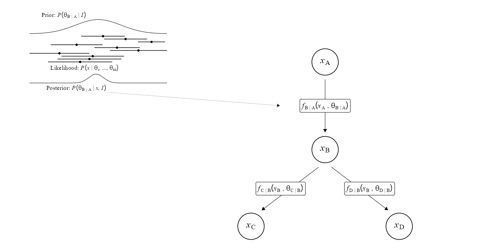

Constructing a PPMN therefore requires two related specifications: the
directed network structure and the parameterized edge-functions
associated with each incoming edge. The following section shows how
these components are defined in the package.

## Specifying network structure

We begin by defining each variable ($`X = \{ x_1, ..., x_n \}`$) that
constitute the network and the directed dependencies among them. Each
non-root vertex must be associated with a edge-function that maps its
parent variable $`x_p`$ to a child vertex $`x_c`$. A edge-function is
expressed as

``` math
x_c=f_{c|p}(x_p, \theta_{c|p})
```
with it corresponding parameter $`\theta_{c|p}`$. An example could be
the relations between Total Phosphorus (TP) to Chlorophyll-a (Chl). We
fitted for example three models A-D and found one intercept (b0) and
slope (b1) in two separated studies (this is given in `example4` below).
The function is formally expressed as.
``` math

x_{Chl}=f_{Chl|TP}(x_{TP}, \theta_{Chl|TP}) 
```
However, the actual function is a linear equation where both the
dependent and independent variable are log transformed. The expression
of the function is to describe its relation and content. However, to the
observant reader the fitted model is actually $`log(y)=b0+b1*log(x)`$
and describes the *deterministic* part of a GLM with log-link where the
independent variable is log-transformed. Therefore, the expression above
would in its predictive form be expressed as given below.
``` math

x_{Chl}=f_{Chl|TP}(x_{TP}, \theta_{Chl|TP}) = exp\{\beta_0 + \beta_1 \cdot Log(x_{TP})\}
```
We only needs to fit models to collect the `estimate` and `error` and
indicate the functional relation between the dependent and independent
variable(s) and how the independent variables have been transformed. As
an example see the data frame (`example4`) with the following columns
below. In this data frame the columns `function`, `transformation`,
`edge` `parameter`, `estimate` and `error` are required. The column
`estimate` contains all numeric values of all intercept and slopes and
the column `error` its corresponding standard error. We need to indicate
to what `parameter` the `estimate` and `error` belong to. The parameter
are b0 = $`\beta_0`$ and b1 = $`\beta_1`$, which in layman terms are
called the intercept and slope, respectively. The column `edge`
indicates the formula you would use in a standard `lm` or `glm` and is
used to connect the dependent and independent variables. The column
`transformation` indicates how all independent variables are
transformed. It is applied to all independent variable and cannot be
applied to one. The column `function` is important, it tells the code
how we want to connect (what type of shape) the dependent and
independent variables. The PPMN can apply different functions and used
different types of parameters, that are not only intercepts or slopes
and there can be functions added. Later we will come back to the
functions currently available in the library. In the `example4` the
columns `Source`, `Authors`, `Comment` could be omitted, but are
displayed to show a table we would standard compile during a
meta-analysis.

``` r

#Load example
data("example4")

#Display head
head(example4)
#> # A tibble: 6 × 9
#>   Source Authors Comment `function` transformation edge   parameter estimate
#>   <chr>  <chr>   <lgl>   <chr>      <chr>          <chr>  <chr>        <dbl>
#> 1 A      A       NA      log        log            Chl~TP b0           -0.8 
#> 2 A      A       NA      log        log            Chl~TP b1            1.1 
#> 3 B      A       NA      log        log            Chl~TP b0           -0.2 
#> 4 B      A       NA      log        log            Chl~TP b1            0.93
#> 5 C      C       NA      log        log            Chl~TP b0           -1.1 
#> 6 C      C       NA      log        log            Chl~TP b1            1.05
#> # ℹ 1 more variable: error <dbl>
```

Each of the fitted models (`Source` = `A, B, C, D, E`) was a GLM, with
log-link and log-transformed independent variable. It is also possible
to only include an intercept or slope. To indicated the type of
*deterministic* part of the GLM was used, the column `function` is
indicated as *log*. Since the independent variable was log-transformed
we denote *log* in the column `transformed`. If a log-transformation was
not possible a square-root transformation *sqrt* can be used. If no
transformation has been applied then the cell should remain empty. Other
transformations can be added to the library on request.

## Build PPMN function

We have a meta-analytic data frame (`example4`) with all columns and
want to synthesize everything into a PPMN (which is at the moment only a
single edge). We need to connect the data frame with information to the
desired network structure and for this the `build_ppmn` function is
used. This function builds the network structure and performs
meta-analysis by connecting the columns `function`, `edge`
`transformation` in the data frame (`example4`) to this structure. To
specify each unique link we need to create a formula as given below.
That formula should indicates the function `fun` *log* and the `edge`
*Chl~TP* and type of transformation `trans` *log*. If no transformation
is applied the argument `trans` can be omitted from the formula.

``` r

#We need to create a formula
formula=list(c(fun="log", edge="Chl~TP", trans="log"))
```

The PPMN however aims at maximizing information use. Therefore it uses a
(empirical) Bayesian Meta-analysis in which the priors maximize the
information to which a model cannot be fitted. Both the likelihood and
prior in this model are assumed to approximate a Gaussian behavior.
Therefore, the estimated parameters are specified via the mean `mu`
($`\mu`$) and standard error `se`. The prior for `mu` of each parameter
b0, b1, b…, bn in an edge-function need tos be indicated with
`prior_mu_b...` the prior for the `se` needs to be indicated with
`prior_se_b...`. If no prior is given the `mu` this defaults to 0 and if
no prior is given for the `se` this defaults to 1000. Additionally, it
is possible to truncate (cutoff) the distribution, restricting the
outcome to only a part of the parameter space. For this we the lower
truncation is indicated by `trunc_a_b...` and upper truncation \>
`trunc_b_b...`.

``` r

formula=list(c(fun="log", edge="Chl~TP", trans="log",
               prior_mu_b0=-0.5, prior_se_b0=0.5,
               prior_mu_b1=1, prior_se_b1=0.5, trunc_a_b1=0))
```

In our example a prior was already know the intercept falls around
$`-0.5`$ and within the interval range of
$`~2.5\% = -0.5 - 2 \cdot 0.5=-1.5`$ and
$`~97.5\% = -0.5 + 2 \cdot 0.5=0.5`$. For the slope around $`1`$ and
within the interval range of $`~2.5\% = 1 - 2 \cdot 0.5=0`$ and
$`~97.5\% = 1 + 2 \cdot 0.5=2`$ we also assume the slope will definitely
be \>0 and therefore truncate the lower boundary (`trunc_a_b1`) at 0.
This formula represents a single edge-function from TP to Chl.

At this moment we have all ingredients (the formula and data) to build a
foundational PPMN. To construct the foundational PPMN, both the formula
and data need to be introduced into the `build_ppmn` function. This is
shown below.

``` r

foundational_ppmn <- build_ppmn(formula = formula, data = example4,
                                vertex_height = 0.14,
                                vertex_width = 0.02,
                                fun_width = 0.1,
                                fun_height = 0.25)
```

After building the foundational PPMN, the single edge can be display in
a DAG,

``` r

foundational_ppmn$PlotDAG
```

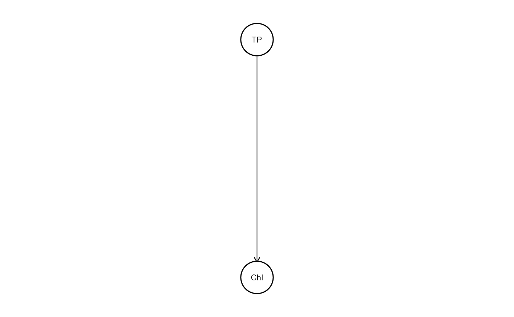

or as a Directed Bipartite Network, where the boxes represent the
edge-functions and the variables the circles.

``` r

foundational_ppmn$PlotDBN
```

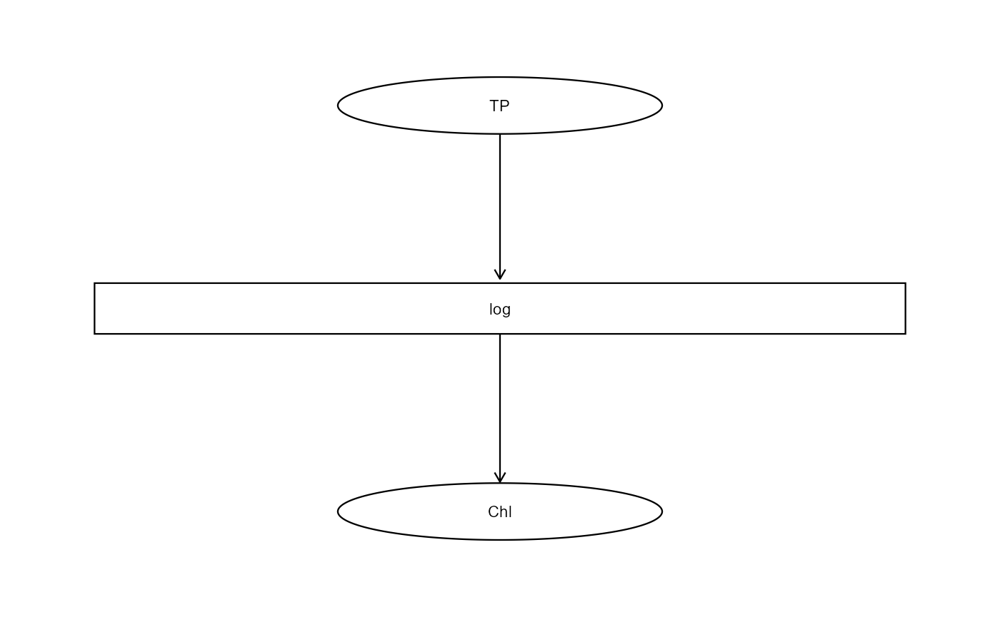

A slightly more complex example would introduce use to a more complex
edge-function and network. For example, we wish to regress *Chl~TN+TP*
and use Chl to predict phytoplankton taxa richness of *Taxa~Chl*. To
bring a last formal expression of this network both edge-functions are
described below.

``` math

f_{Chl|TN, TP}(.) = f_{Chl|TN, TP}(x_{TN}, x_{TP}, \theta_{Chl|TN,TP,1},  \theta_{Chl|TN,TP,2}) = exp\{\beta_0 + \beta_1 \cdot Log(x_{TN}) + 
```
and

``` math

f_{Taxa|Chl}(.)=f_{Taxa|Chl}(x_{Chl}, \theta_{Taxa|Chl})=exp(\beta_0 + \beta_1 \cdot Log(x_{Chl}))
```

Both edge function are then combined to form a network expressed as
below

``` math

f_{Taxa|Chl}(f_{Chl|TN, TP}(x_{TN}, x_{TP}, \theta_{Chl|TN,TP,1},  \theta_{Chl|TN,TP,2}), \theta_{Taxa|Chl})
```

The formula should then be specified as below. A minor addition is the
inclusion of two priors for the edge *Taxa~Chl*. Assume there are two
individuals authors/managers or methods to produce the priors then both
sources of information are sources of uncertainty may be both be added.
The meta-analysis incorporates this via Bayesian Model Averaging (BMA).
Directly after building the foundational PPMN we choose to display the
graphical representation as DBN.

``` r

#Load example
data(example5)

#Display first rows
head(example5)
#> # A tibble: 6 × 9
#>   Source Authors Comment `function` transformation edge      parameter estimate
#>   <chr>  <chr>   <lgl>   <chr>      <chr>          <chr>     <chr>        <dbl>
#> 1 A      A       NA      log        log            Chl~TN+TP b0           -0.8 
#> 2 A      A       NA      log        log            Chl~TN+TP b1            0.34
#> 3 A      A       NA      log        log            Chl~TN+TP b2            1.1 
#> 4 B      B       NA      log        log            Chl~TN+TP b0           -0.2 
#> 5 B      B       NA      log        log            Chl~TN+TP b1            0.7 
#> 6 B      B       NA      log        log            Chl~TN+TP b2            0.93
#> # ℹ 1 more variable: error <dbl>

#Create a formula
formula=list(c(fun="log", edge="Chl~TN+TP", trans="log",
               prior_mu_b0=-0.5, prior_se_b0=0.5,
               prior_mu_b1=0.5, prior_se_b1=0.5, trunc_a_b1=0,
               prior_mu_b2=1, prior_se_b2=0.5, trunc_a_b2=0),
             
             c(fun="log", edge="Taxa~Chl", trans="log",
               prior_mu_b0=0, prior_se_b0=5,
               prior_mu_b1=c(0.3, 0.5), prior_se_b1=c(0.5, 1), trunc_a_b1=0))

#Build the foundational PPMN
foundational_ppmn <- build_ppmn(formula = formula, data = example5, 
                                vertex_width = 0.07,
                                fun_width = 0.08)

#Display the Directed Bipartite Network
foundational_ppmn$PlotDBN
```

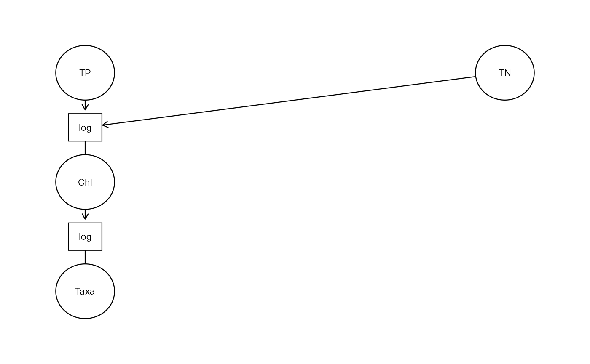

We can also inspect the structure of the synthesized network by printing
a summary of the model in tabular form. The summary reports the number
of vertices, the number of synthesized parameters in the network, and
the number of parameter estimates provided in the meta-data. This is
followed by a table describing each individual edge function, including
the corresponding edge, function type, dependent and independent
variables, and the additional information required to define the model.

``` r

#print the summary.
print(foundational_ppmn)
#> 
#> Posterior Predictive Meta-Analytic Network
#> -------------------------------------------
#> 
#> Vertices               : 4 
#> Synthesized parameters : 5 
#> Parameter estimates    : 15 
#> Updates                : 0 
#> 
#>       edge edge function dependent independent parameters     mu    se     ll
#>  Chl~TN+TP           log       Chl        <NA>         b0 -0.661 0.211 -1.009
#>  Chl~TN+TP           log       Chl          TN         b1  0.414 0.089  0.268
#>  Chl~TN+TP           log       Chl          TP         b2  1.015 0.190  0.702
#>   Taxa~Chl           log      Taxa        <NA>         b0  1.013 0.162  0.747
#>   Taxa~Chl           log      Taxa         Chl         b1  0.488 0.061  0.388
#>      ul     sd tau2 I2    a   b n
#>  -0.314 0.2113    0  0 -Inf Inf 3
#>   0.560 0.0888    0  0    0 Inf 3
#>   1.328 0.1901    0  0    0 Inf 3
#>   1.278 0.1616    0  0 -Inf Inf 3
#>   0.588 0.0606    0  0    0 Inf 3
```

## Marginal PPMN function

The network structure shows only one view of the information we
incorporated. As with the results of Kaijser et al. (2025) we might be
interested in viewing the association or the marginal edge-function
itself an added variable plot. To do so an example data frame is created
as given below. If we wish to omitted the points as we do not actually
have real data then set the argument `alpha` to 0.

``` r

library(cowplot)

df <- data.frame(TN=c(0.1, 1.25, 3.2, 2.23, 5), 
                 TP=c(5, 11, 27, 42, 83), 
                 Chl=c(0.2, 21, 30, 48, 92),
                 Taxa=c(4, 3, 9, 14, 25))

marginal_fig_Chl  <- marginal_ppmn(foundational_ppmn, child = "Chl", data =  df)
marginal_fig_Taxa <- marginal_ppmn(foundational_ppmn, child = "Taxa", data =  df)

cowplot::plot_grid(marginal_fig_Chl[[1]], #First object is TN
                   marginal_fig_Chl[[2]], #Second object is TP
                   marginal_fig_Taxa[[1]],#This is Chl 
                   ncol=1, labels = "AUTO")
```

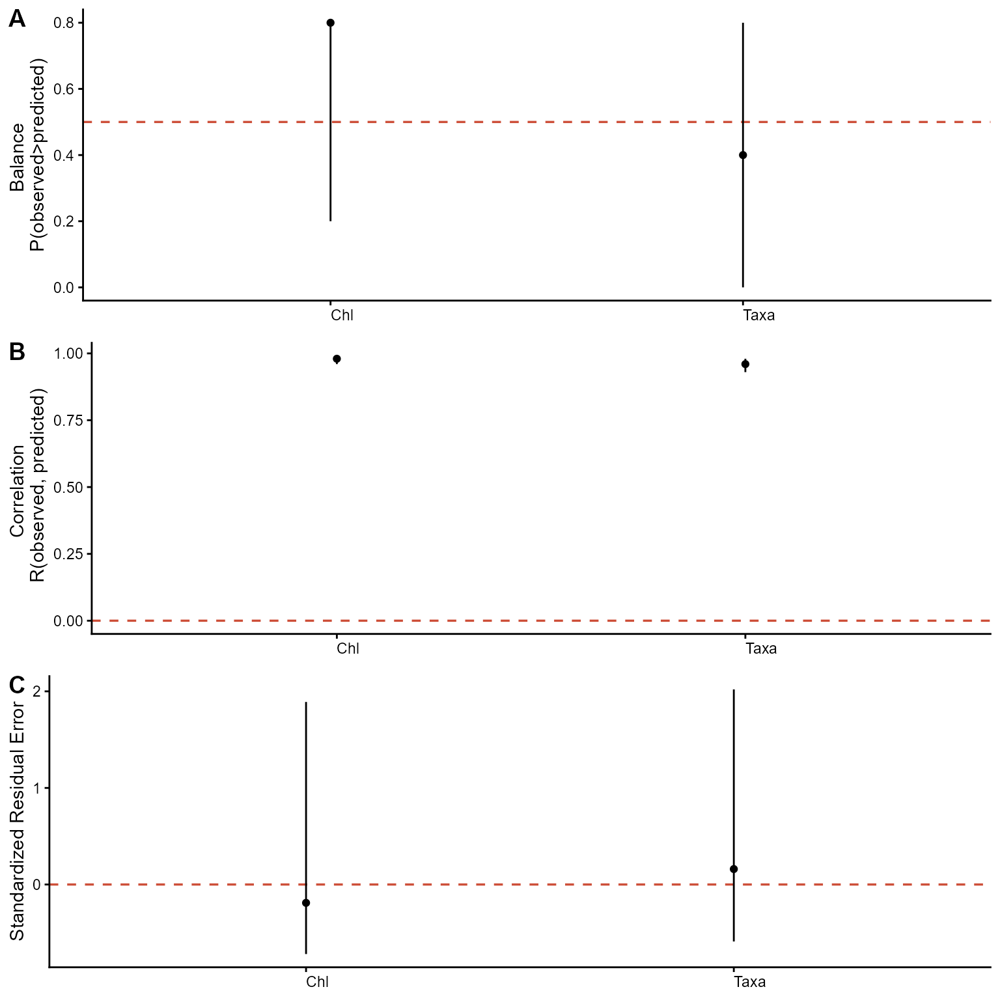

## Predictive fit function

The predictive fit function is used to assess the performance of the
PPMN on new data. It return three metric to assess predictive
performance.

The balance is given by the average fraction of positive signs and
informs about the centrality of the model within for each prediction
$`\hat x`$. Values close to 0.5 indicate that predictions lie
centralized within observations, while balance close to 0 and 1 indicate
predictions lie lower and higher than the observations.

``` math

P(observed>predicted)=\frac{1}{N}\sum_{s=1}^S H(x_c > \hat x_c^{(s)})
```

The pearson correlation correlated the the observed and predicted
values. It provides I judges the sign and strength of the observations
and prediction. A correlation of 0 indicates minimal correlation with
the predictions, close to 1 a strong correlation and \< 0 an opposing
prediction.

``` math

R(observed > predicted) = \frac{Cov(x_c, \hat x_c^{(s)})}{\sqrt{Var(x_c)\cdot Var(\hat x_c^{(s)}})}
```

The standardize residual error (SRE) is calculated using residual error
per child vertex $`c`$ of each simulation $`s`$ divided by over its
standard deviation. An SRE close to 0 means that the prediction of the
model is close to the observed data. An absolute SRE of approximately 1
indicates that the residual is equal to one estimated standard deviation
of the residual distribution. Values of \|3\| or higher are extremely
large.

``` math

SRE_c=\frac{r_c^{(s)}}{\sigma(r_c)}
```

Below an example of the predictive fit function applied to the the
example data given above.

``` r

#Apply the pred_fit function
pred_performance <- pred_fit_ppmn(object = foundational_ppmn, new_data = df)

#Plot the results together
cowplot::plot_grid(pred_performance$plots$Balance, #Predictive balance
                   pred_performance$plots$Correlation, #Predictive correlation
                   pred_performance$plots$Stdz, #Predictive precision
                   ncol=1, labels = "AUTO")
```


## Updating the PPMN

### Specifying network structure

We will use a more elaborated network and data set following the steps
that were explained above to update the PPMN. First we need to build the
formula that defines the network structure.

``` r

#Load example
data(example6)

#Display head
head(example6)
#> # A tibble: 6 × 9
#>   Source      Authors Comment `function` transformation edge  parameter estimate
#>   <chr>       <chr>   <chr>   <chr>      <chr>          <chr> <chr>        <dbl>
#> 1 Charophyte… Kolada… NA      class      NA             Char… b0           9.5  
#> 2 Charophyte… Kolada… NA      class      NA             Char… b1          13.4  
#> 3 Charophyte… Kolada… NA      class      NA             Char… b2          37.7  
#> 4 Charophyte… Kolada… NA      class      NA             Char… b3          38.7  
#> 5 Charophyte… Kolada… NA      class      NA             Char… b4           0.530
#> 6 Macrophyte… Kaijse… NA      class      NA             Char… b0          14.3  
#> # ℹ 1 more variable: error <dbl>

#Set the formula of the full network
formula=list(c(fun="sigmoidal", edge="Chl~TP", trans="log",
               prior_mu_b0=100, prior_se_b0=50, trunc_a_b0=0, trunc_b_b0=10000,
               prior_mu_b1=6.2, prior_se_b1=1.6, trunc_a_b1=0,
               prior_mu_b2=0, prior_se_b2=1, trunc_a_b2=0),

             c(fun="log", edge="Macrophytes~Chl+Temp+CO2onlyuser", trans="log"),

             c(fun="class", edge="Characeae~Chl"),

             c(fun="sigmoidal", edge="pH~Chl"),

             c(fun="sigmoidal", edge="CO2~pH"),

             c(fun="logit", edge="CO2onlyuser~HCO3", trans="log"),

             c(fun="log", edge="DOC~Chl", trans="log"),

             c(fun="log",  trans="log", edge="DO~DOC+Temp"),

             c(fun="sigmoidal", edge="HCO3~pH"))

#Build the PPMN and define size of the vertices
foundational_ppmn <- build_ppmn(formula = formula, data = example6, txt_size = 3, vertex_height = 0.4, vertex_width = 0.48, arrow_offset = 4)

#Display graph as directed bipartite network
foundational_ppmn$PlotDBN
```

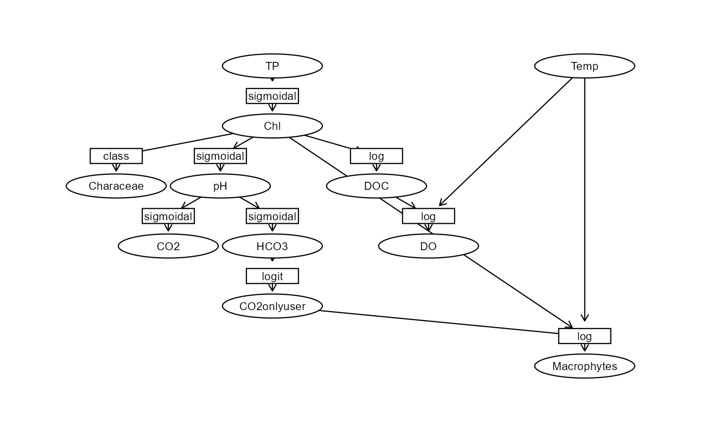

The full foundational PPMN has now been build and all previous function
can be applied. However, we are interested in updating the PPMN so that
it can learn the constrains of the data if only the roots give provide
information. For this the `update_ppmn` function can be use under
default with the additionally data from which it can learn the
multivariate constrains.

### Default training mode

``` r

#Load example of training data
data(train_data)

#Display head
head(train_data)
#> # A tibble: 6 × 10
#>      TP  Temp   Chl    pH  HCO3    DO Characeae Macrophytes CO2onlyuser   DOC
#>   <dbl> <dbl> <dbl> <dbl> <dbl> <dbl>     <dbl>       <dbl>       <dbl> <dbl>
#> 1   6    9.30  7.05  5.94   NA   5.50         0           6       0.833 NA   
#> 2  46   16.7   7.9   8.2   146.  6.04         1          16       0.375 NA   
#> 3  86.6 14.4  11     7.84   NA   6.96         1          24       0.292  8.35
#> 4 195.   7.8  22.4   8.79   NA  12.5          0           7       0.286 NA   
#> 5  44.6 19    13     7.85   NA   8.68         1          14       0.286 NA   
#> 6  12.0 17.0   2.6   5.86   NA  NA            0           6       0.833 NA

#Update the foundational ppmn
updated_ppmn <- update_ppmn(object = foundational_ppmn, new_data = train_data)

#Display the residuals
updated_ppmn$Residuals$resid_boxplot
```

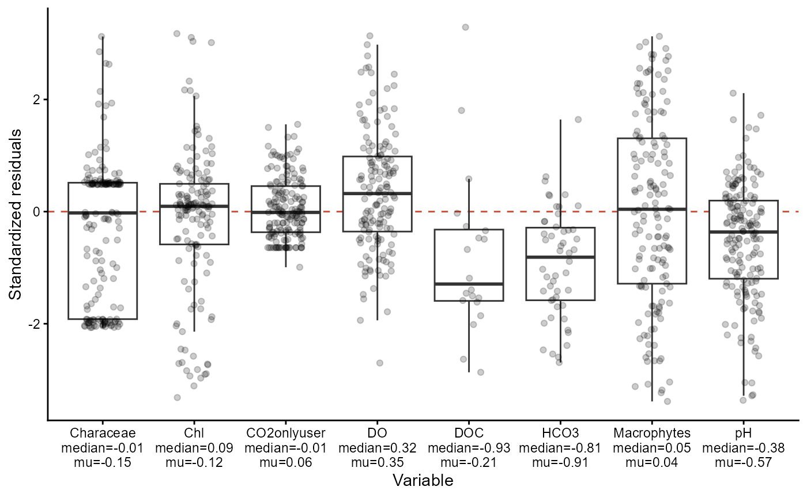

### Fixed information gain training

It is also possible to influence the update strength and manually define
how strongly the posterior is allowed to concentrate. The update
strength is then indirectly determined via the Kullback-Leibler
divergence (KL-divergence). This is performed by setting the `method` to
`manual` and defining `up_character` as a proportion of the
concentration between 0 and 1.

``` r

#Update the foundational ppmn allowing the data to dominate by 5%
updated_ppmn_5 <- update_ppmn(object = foundational_ppmn, new_data = train_data, method = "manual", up_character = 0.05)

#Update the foundational ppmn allowing the data to dominate by 50%
updated_ppmn_50 <- update_ppmn(object = foundational_ppmn, new_data = train_data, method = "manual", up_character = 0.5)

#Update the foundational ppmn allowing the data to dominate by 95%
updated_ppmn_95 <- update_ppmn(object = foundational_ppmn, new_data = train_data, method = "manual", up_character = 0.95)

#Display the residuals on top of each other
cowplot::plot_grid(
  updated_ppmn_5$Residuals$resid_boxplot,
  updated_ppmn_50$Residuals$resid_boxplot,
  updated_ppmn_95$Residuals$resid_boxplot,
  ncol=1, labels=c("KL fraction 5%",
                   "KL fraction 50%",
                    "KL fraction 95%"),
  label_y=1.02, label_x=1.25)
```

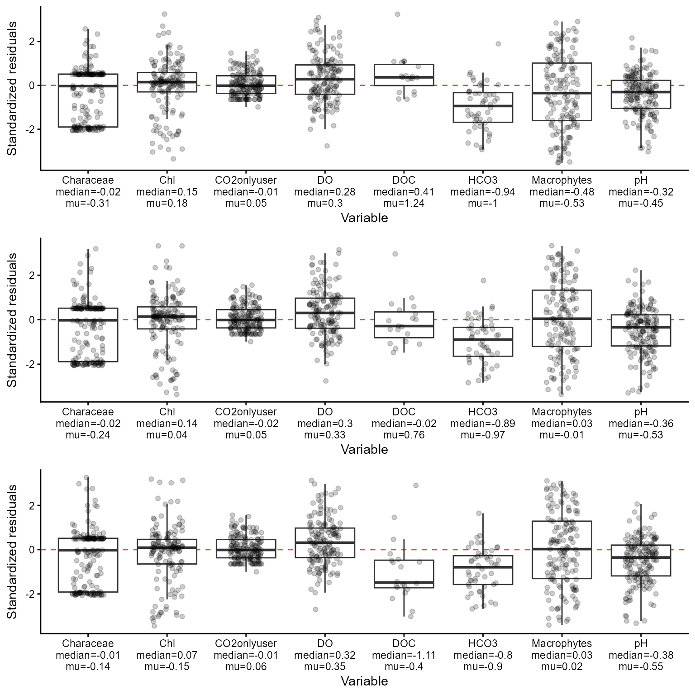

Below the box plots the median and mu (mean) indicate the center of the
residuals. For Characeae, the residuals are standardized. However,
Characeae is a binary response variable, and while standardization via
the pearson residuals is correct $`\sqrt{p\cdot (1-p)}`$there remains a
gap especially because the data is dominated by presences. The majority
of the residuals seem well centered with exception of DOC and HCO3. Of
course, this could be further investigated looking at the marginal
predictions. This especially easy because each edge function is an
univariate relation.

### Display the marginal trends

``` r

#Create the marginal plots
marginal_fig_HCO3 <- marginal_ppmn(updated_ppmn, child = "HCO3", data = train_data)
marginal_fig_DOC  <- marginal_ppmn(updated_ppmn, child = "DOC", data = train_data)

#Plot them togheter
cowplot::plot_grid(marginal_fig_HCO3[[1]], 
                   marginal_fig_DOC[[1]], 
                   ncol=1, labels = "AUTO")
```

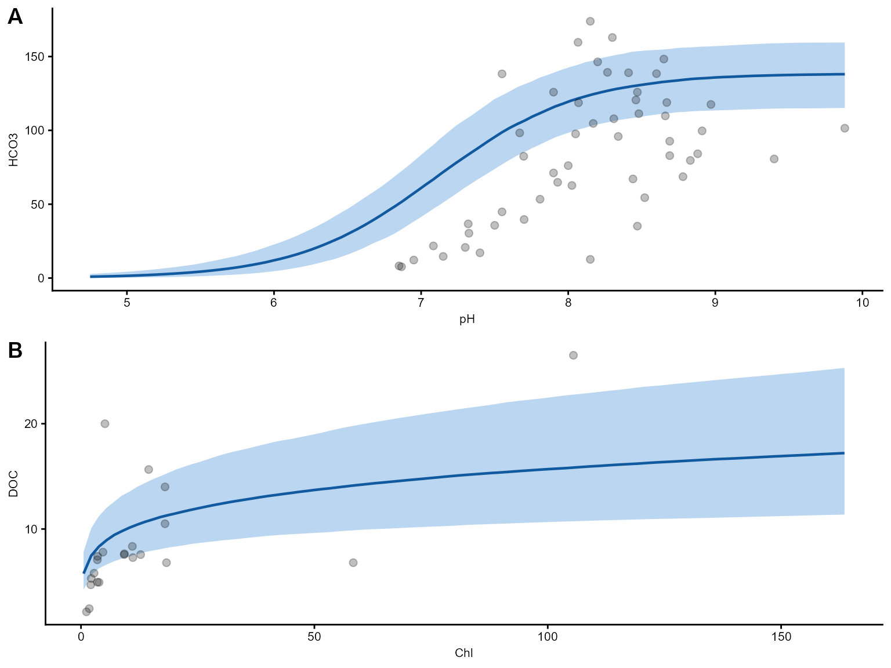

Investigating these figures it is relatively clear why the residuals of
HCO3 are shifted. The PPMN over predicts the new data. For DOC this is
also obvious, the whole log-linear function for DOC is in mismatch with
the actual data. My question for DOC would be why I observe a negative
trend in the data less DOC with more Chl, this seems contradictory to my
expectations. I would expect that upon eutrophication the amount of DOC
would increase due to the the amount of die-off caused by the increasing
algae growth. Hence, the model also does not learn the negative pattern,
because we are strongly invested in a positive relation between DOC~Chl.
Hence, there are two simple reasons:

(1.) The edge function is not the right function. (2.) The data itself
is not proper.

Which one is a discussion point. It is not a failure to establish this,
we might not like it, but we cannot suppress what we do not like. It is
a learning opportunity. if our structural explanation was that DOC~Chl
relation was positive we need to revise this in light of this new
information. Clearly there is a case where this is not so. For HCO3~pH
the mismatch is less severe as we will consequently observe under
further investigation.

These patterns can also be observed when we would move to validation
using the validation data. Of course, this validation data is only a
subset of the whole dataset. Therefore, it will display the same
pattern. However, to obtain a test dataset that independent of training
and validation dataset would provide a more comprehensive overview.

### Apply predictive fit to validation data

``` r

#Assess the performance of the updated ppmn on the validation data 
pred_fit_val  <- pred_fit_ppmn(updated_ppmn, val_data, rotate_x = 45, hjust = 1)

#Plot the results of the updated model applied on the validation data
cowplot::plot_grid(pred_fit_val$plots$Balance,
                   pred_fit_val$plots$Correlation,
                   pred_fit_val$plots$Stdz,
                   labels="AUTO", ncol=1)
```

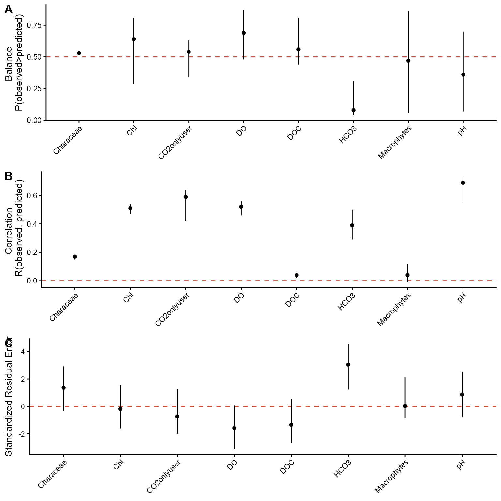

Also here we see that HCO3 and DOC deviate. Based on this I accept the
deviation of HCO3. I have another dataset that only contains HCO3~pH
containing which shows a ‘perfect’ fit. However, DOC~Chl I can not
explain properly. This would need further explanation from literature.
Having assessed on the validation data we could accepted the
discrepancies and notate them or update on another data, or reconstruct
the PPMN.

## Root estimation

The root estimation allows a user to estimate value at the vertices that
are roots based on values in the leafs. For this we need to set
plausible values that might inform us about conditions in the roots. For
example I would like to know what the TP or Temperature concentrations
are if I observe 15 or 1 macrophytes in the leafs.

I would need to generate monte carlo sampels for TP and Temperature that
represent the priors.

``` r

#Set priors for TP and Temp
prior        <- data.frame(TP = rgamma(3000, 80^2/100^2, 80/100^2),
                           Temp = c(rbeta(3000, 1.5, 3.5)*40))
prior$Temp   <- prior$Temp+(1-(prior$Temp/40))*4

#Display the prior distributions
cowplot::plot_grid(

ggplot(prior, aes(TP))+
  geom_histogram(col="black", fill="grey80", alph=0.3, bins=15)+
  theme_classic(),

ggplot(prior, aes(Temp))+
  geom_histogram(col="black", fill="grey80", alph=0.3, bins=15)+
  theme_classic(),

ncol=2)
```

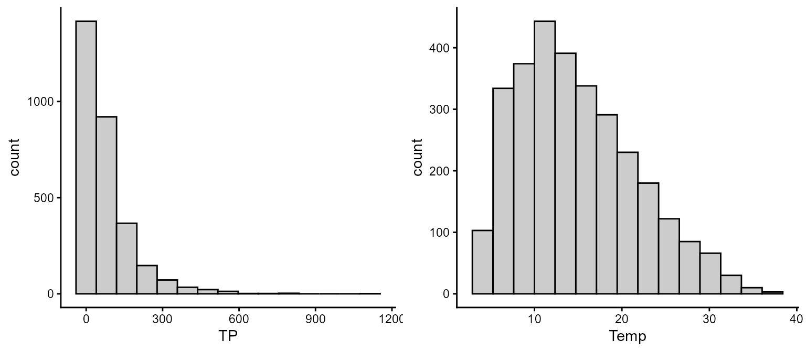

The root estimation needs to be initiated by setting the targeted vertex
that is observed (child). In this example this is `Macrophytes`.
Standard display of the prior and posterior uses a standard Gaussian
kernel density. However, using the Gaussian the visualization might
reach negative values.

``` r

#run estimation for 15 macrophytes
mac_15 <-  root_est_ppmn(updated_ppmn, child = "Macrophytes",
                        kde_method = "Gamma",
                        target_value = 15,
                        lab_x = 0.2,
                        prior = prior)

#run estimation for 1 macrophyte
mac_1 <-  root_est_ppmn(updated_ppmn, child = "Macrophytes",
                        kde_method = "Gamma",
                        target_value = 1,
                        lab_x = 0.2,
                        prior = prior)
```

For 15 macrophyte species the expected values for TP and temperature are
displayed as below.

``` r

#Plot results for 15 macrophytes
cowplot::plot_grid(mac_15$plots$TP, 
                   mac_15$plots$Temp, 
                   ncol=2, labels="AUTO")
```

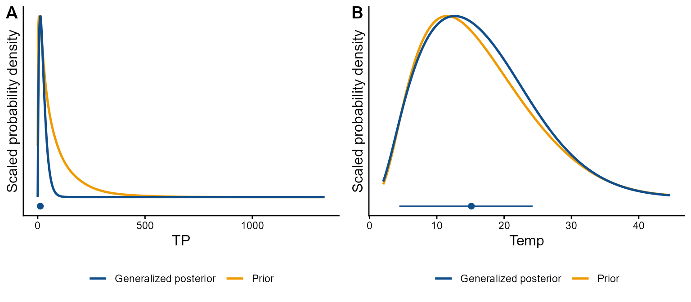

``` r

#The summary of the results
mac_15$summary
#>      root       mu      med       se       ll       ul
#> TP     TP 10.75515 10.59498 1.093059 9.224247 12.68953
#> Temp Temp 15.03629 14.64215 6.416436 5.290349 24.23722
```

For 1 macrophyte species the expected valuss for TP and temperature are
displayed as below.

``` r

#Plot results for 1 macrophyte
cowplot::plot_grid(mac_1$plots$TP, 
                   mac_1$plots$Temp, 
                   ncol=2, labels="AUTO")
```

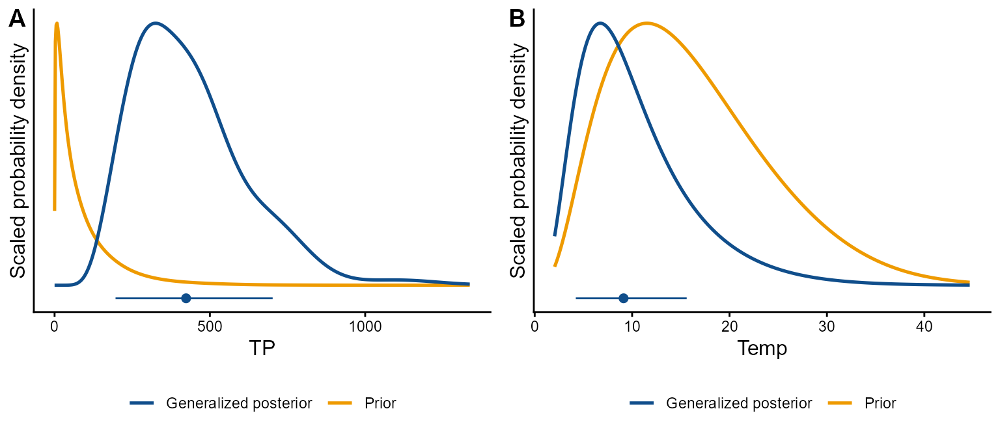

``` r

#The summary of the results
mac_1$summary
#>      root        mu        med         se         ll       ul
#> TP     TP 444.86518 422.588996 179.123903 196.427991 702.1239
#> Temp Temp  10.05218   8.419107   5.149246   4.217925  17.5294
```

Clearly the observed variance of the expected value is much smaller for
15 macrophyte species than for 1 macrophyte species. From this we can
infer that the information 15 species provides more information about
the environmental conditions than 1. That does not mean that if we would
focus on the identity of species we could not learn much more.

## Edge functions

There are different functions that can be used in the PPMN. These are
not limited to the ones provided here. Upon request I can add different
functions that might be useful for the user. Of course the standard
functions consist of the linear equation and link functions used with
GLMs. The standard LM and GLM with random effect structure can be fit
with most basic R-packages (e.g., lmer, glmmTMB or gamlss). Not that
standard practice, such as assessing the residuals is here implicitly
assumed.

The syntax used for the PPMN express the equation using “b” ($`\beta`$
or $`\theta`$) for “b0” ($`\beta_0`$ or $`\theta_0`$) or “b1”
($`\beta_1`$ or $`\theta_1`$) etc. Each parameter in the equation follow
the notation b0, b1, b2, …, etc.

### Linear equation

For the linear equation the standard expression is used of which the
name is `identity`. In this equation Where $`p\in P`$ describes the
number of parents (e.g., 1, 2, 3, …, P). In the linear equation also the
number of parents, with exception of 0 is the number of parameters.

``` math

x_c=b_0+\sum_{p=1}^P(b_p\cdot x_p)
```

### Log-linear equation

For the log-linear equation the standard expression is also used of
which the name is `log`.

``` math

log(x_c)=b_0+\sum_{p=1}^P(b_p\cdot x_p)
```

### Logit-linear equation

For the log-linear equation the name is `logit`.

``` math

log(\frac{x_c}{(1-x_c)})=b_0+\sum_{p=1}^P(b_p\cdot x_p)
```

### Sigmoidal equation

For the three parameter sigmoidal equation used of which the name is
`sigmoidal`. b0 describes the asymptote, b1 the midpoint and b2 the
scale parameter. Indeed multiple parents are possible with this function
which continues at b4. The parameters then enter as
$`b_1-x_1+\sum_{p=4}^P( b_p \cdot x_2)`$ and continue from $`b_4`$
onward. However, this function seems relatively unstable.

``` math

x_c=\frac{b_0}{(1+exp(\frac{(b_1-x_p)}{b_2}))}
```
This equation can be fitted with the `nls` function from the `stats`
package in R. See the example below

``` r

#load the stats package
library(stats)

#Model parameters
b0 <- 200
b1 <- 6
b2 <- 0.5

#Independent variables
x  <- runif(150, 3.5, 10)

#Dependent variable
eta <- b0/(1+exp((b1-x)/b2))

#Add some noise
y <- rgamma(length(eta), eta^2/30^2, eta/30^2)

#Create data frame
df <- data.frame(x, y)

#Plot as figure
ggplot(df, aes(x, y))+
  geom_point(size=3, alpha=0.3)+
  geom_line(data=data.frame(x, eta), aes(x, eta), inherit.aes = F,
            col="dodgerblue3", lwd=1.2)+
  theme_classic()
```

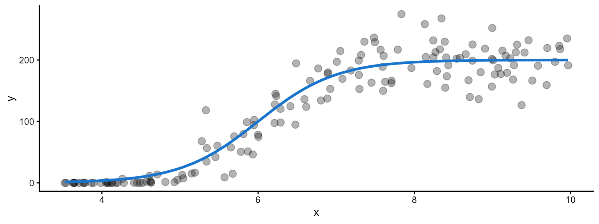

``` r

#Fit model
sigmoidal_mod <- nls(y ~ SSlogis(x, b0, b1, b2), 
                     data = df,
                     control = nls.control(maxiter = 5000, warnOnly = TRUE),
                     start = list(b0 = 200, b1=5, b2=.5))

#Display estimated parameters that are being used in the PPMN
summary(sigmoidal_mod)
#> 
#> Formula: y ~ SSlogis(x, b0, b1, b2)
#> 
#> Parameters:
#>     Estimate Std. Error t value Pr(>|t|)    
#> b0 199.75517    3.47923  57.414   <2e-16 ***
#> b1   6.09134    0.05188 117.413   <2e-16 ***
#> b2   0.45276    0.04629   9.781   <2e-16 ***
#> ---
#> Signif. codes:  0 '***' 0.001 '**' 0.01 '*' 0.05 '.' 0.1 ' ' 1
#> 
#> Residual standard error: 25.79 on 147 degrees of freedom
#> 
#> Number of iterations to convergence: 7 
#> Achieved convergence tolerance: 3.861e-06
```

### Gompertz equation

For the gompertz equation the name is `gompertz`. In this equation, b0
is the asymptote, b1 is the displacement constant and b2 is the growth
rate. This function also allows other parameters to access the equation
$`b_1-x_1+\sum_{p=4}^P( b_p \cdot x_2)`$ similar to the sigmoidal
equation, but has the same curse.

``` math

x_c=b_0 \cdot exp(-exp( b_1 - b_2 \cdot x_p))
```
This equation can also be fitted with the `nls` function.

``` r

#Model parameters
b0 <- 200
b1 <- 6
b2 <- 1

#Independent variables
x  <- runif(150, 3.5, 10)

#Dependent variable
eta <- b0*exp(-exp(b1-b2*x))

#Add some noise
y <- rgamma(length(eta), eta^2/30^2, eta/30^2)

#Create data frame
df <- data.frame(x, y)

#Plot as figure
ggplot(df, aes(x, y))+
  geom_point(size=3, alpha=0.3)+
  geom_line(data=data.frame(x, eta), aes(x, eta), inherit.aes = F,
            col="dodgerblue3", lwd=1.2)+
  theme_classic()
```

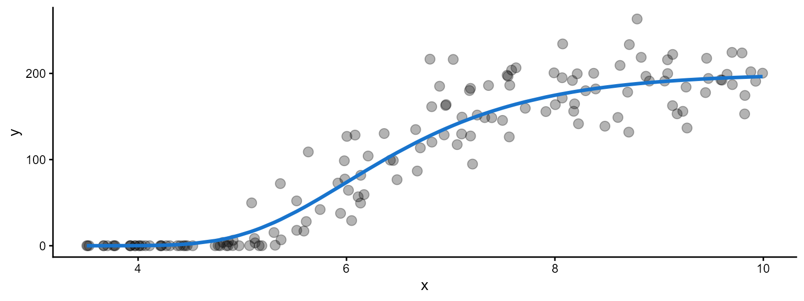

``` r

#Fit model
gompertz_mod <- nls(y ~ b0 * exp(-exp(b1 - b2*x)),
                    data = df,
                    control = nls.control(maxiter = 5000, warnOnly = TRUE),
                    start = list(b0 = 200, b1 = 5, b2 = 1))

#Display estimated parameters that are being used in the PPMN
summary(gompertz_mod)
#> 
#> Formula: y ~ b0 * exp(-exp(b1 - b2 * x))
#> 
#> Parameters:
#>    Estimate Std. Error t value Pr(>|t|)    
#> b0 193.6638     4.9075  39.463   <2e-16 ***
#> b1   7.6629     0.8203   9.342   <2e-16 ***
#> b2   1.2838     0.1373   9.348   <2e-16 ***
#> ---
#> Signif. codes:  0 '***' 0.001 '**' 0.01 '*' 0.05 '.' 0.1 ' ' 1
#> 
#> Residual standard error: 25.4 on 147 degrees of freedom
#> 
#> Number of iterations to convergence: 6 
#> Achieved convergence tolerance: 2.96e-06
```

### Asymptotic-linear

For the asymptotic-linear equation the name is `asymptotic`. In this
equation, b0 is the asymptote, b1 is the displacement constant and b2 is
the growth rate. This function also allows other parameters to access
the equation $`b_1-x_1+\sum_{p=4}^P( b_p \cdot x_2)`$ similar to the
sigmoidal equation, but has the same curse.

``` r

#Model parameters
b0 <- 100
b1 <- 120
b2 <- 0.1

#Independent variables
x  <- runif(150, 1, 100)

#Dependent variable
eta <- b0-b1*exp(-b2*x)

#Add some noise
y <- rgamma(length(eta), eta^2/20^2, eta/20^2)

#Create data frame
df <- data.frame(x, y)

#Plot as figure
ggplot(df, aes(x, y))+
  geom_point(size=3, alpha=0.3)+
  geom_line(data=data.frame(x, eta), aes(x, eta), inherit.aes = F,
            col="dodgerblue3", lwd=1.2)+
  theme_classic()
```

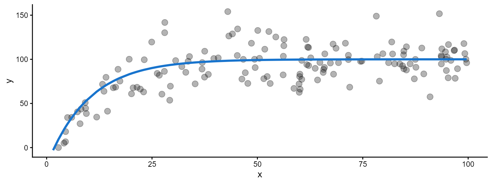

``` r

#Fit model
asymptotic_mod <- nls(
  y ~ b0 - b1 * exp(-b2 * x),
  data = df,
  control = nls.control(maxiter = 5000, warnOnly = TRUE),
  start = list( b0 = 200, b1 = 120, b2 = 0.1))

#Display estimated parameters that are being used in the PPMN
summary(asymptotic_mod)
#> 
#> Formula: y ~ b0 - b1 * exp(-b2 * x)
#> 
#> Parameters:
#>     Estimate Std. Error t value Pr(>|t|)    
#> b0  99.54370    1.95759  50.850  < 2e-16 ***
#> b1 127.46817   14.99165   8.503 2.07e-14 ***
#> b2   0.09164    0.01452   6.310 3.19e-09 ***
#> ---
#> Signif. codes:  0 '***' 0.001 '**' 0.01 '*' 0.05 '.' 0.1 ' ' 1
#> 
#> Residual standard error: 18.45 on 145 degrees of freedom
#> 
#> Number of iterations to convergence: 4 
#> Achieved convergence tolerance: 5.18e-06
#>   (2 observations deleted due to missingness)
```

### Gaussian equation

For the Gaussian equation the name is `gaussian`. b0 represents the peak
(max), b1 the mean and b2 the standard deviation.

``` math

x_c = b_0 \cdot exp(-0.5 \cdot (\frac{(x - b_1)}{b_2})^2)
```

``` r

#Model parameters
b0 <- 200
b1 <- 6
b2 <- 1

#Independent variables
x  <- runif(150, 1.5, 9)

#Dependent variable
eta <- b0*exp(-0.5*((x-b1)/b2)^2)

#Add some noise
y <- rgamma(length(eta), eta^2/30^2, eta/30^2)

#Create data frame
df <- data.frame(x, y)

#Plot as figure
ggplot(df, aes(x, y))+
  geom_point(size=3, alpha=0.3)+
  geom_line(data=data.frame(x, eta), aes(x, eta), inherit.aes = F,
            col="dodgerblue3", lwd=1.2)+
  theme_classic()
```

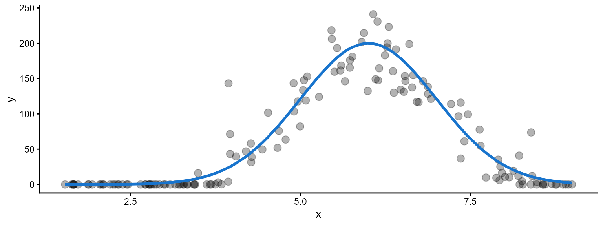

``` r

#Fit model
gaussian_mod <- nls(y ~ b0 * exp(-0.5 * ((x - b1)/b2)^2),
  data = df,
  control = nls.control(maxiter = 5000, warnOnly = TRUE),
  start = list(b0 = 200,b1 = 6, b2 = 1.5))

#Display estimated parameters that are being used in the PPMN
summary(gaussian_mod)
#> 
#> Formula: y ~ b0 * exp(-0.5 * ((x - b1)/b2)^2)
#> 
#> Parameters:
#>     Estimate Std. Error t value Pr(>|t|)    
#> b0 187.57963    4.26075   44.02   <2e-16 ***
#> b1   5.95873    0.03088  192.96   <2e-16 ***
#> b2   1.02321    0.03020   33.88   <2e-16 ***
#> ---
#> Signif. codes:  0 '***' 0.001 '**' 0.01 '*' 0.05 '.' 0.1 ' ' 1
#> 
#> Residual standard error: 22.01 on 147 degrees of freedom
#> 
#> Number of iterations to convergence: 5 
#> Achieved convergence tolerance: 1.43e-06
```

### Bayesian classifier

The Bayesian classifier is an equation that makes use of the mean and
standard deviation of two groups. There is no process of fitting with
maximum likelihood necessary. The name of this edge function is `class`.
In this equation b0 and b1 are the mean and standard deviation of group
1, respectively. b2 and b3 are the mean and standard deviation of group
2. b5 is the proportion of group 1.

``` math

x_c = Log(\frac{N(x_p | b_0, b_1)}{N(x_p | b_2, b_3)})\cdot Log(\frac{b_4}{1-b_4})
```

For the sake of displaying the pattern.

``` r

#Model parameters
b0 <- 20
b1 <- 5
b2 <- 100
b3 <- 25
b4 <- 0.5

#Independent variables
x  <- runif(150, 10, 80)

#Dependent variable
p   <- exp(dnorm(x, b0, b1, log=T) - dnorm(x, b2, b3, log=T))
eta <- (p*b4)/((p*b4)+(1-b4))

#Add some noise
y <- rbinom(length(eta), 1, eta)

#Create data frame
df <- data.frame(x, y)

#Plot as figure
ggplot(df, aes(x, y))+
  geom_point(size=3, alpha=0.3)+
  geom_line(data=data.frame(x, eta), aes(x, eta), inherit.aes = F,
            col="dodgerblue3", lwd=1.2)+
  theme_classic()
```

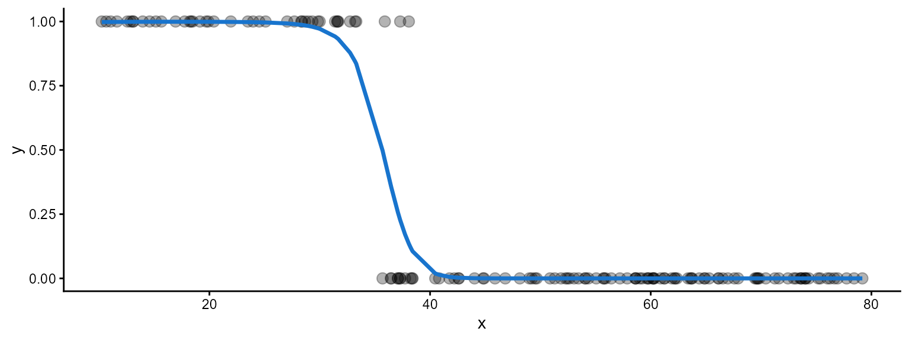
